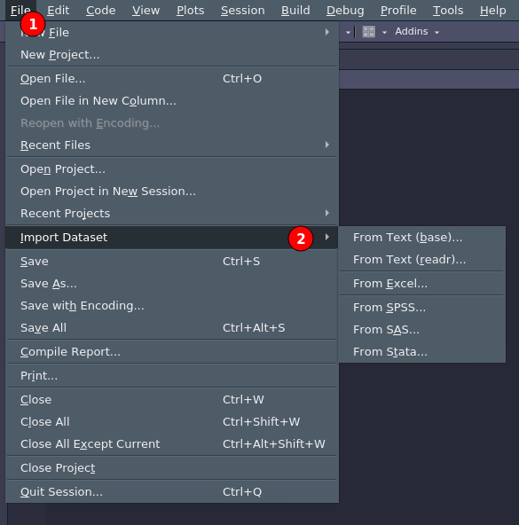

```{r setup, include=FALSE}
knitr::opts_chunk$set(echo = TRUE, 
                      warning = FALSE,
                      message = FALSE,
                      fig.align = "center", 
                      fig.retina = 2, 
                      dpi = 300)
```

```{r packages}
devtools::load_all()
```

# Introduzione

Per operazioni semplici o per esercizi si possono creare strutture dati come `vettori`, `liste` o `dataframe` direttamente in R. Tuttavia per lavorare con R è solito **importare** i dati da fonti esterne come file e database.

In R sono disponibili diverse funzioni per importare i dati nei principali formati come `.csv` o `.txt` assieme a diversi pacchetti con funzioni per importare dati nei formati provenienti da altri software come SPSS, Excel, etc. Insomma se esiste un formato specifico probabilmente esiste anche una funzione in R per importarlo `r emo::ji("smile")`

## La logica

A prescindere dal formato specifico, la logica è che un certo tipo di file ha un'estensione che identifica la tipologia come *file di testo* `.txt`, *comma-separated values* `.csv`, *Excel* `.xlsx`. Questo file organizza i dati in un modo specifico e quindi è importante utilizzare la funzione giusta con i giusti argomenti per poter far interpretare ad R i dati in modo corretto.

## RStudio

RStudio permette di importare qualsiasi tipo di dato tramite interfaccia grafica. All'inizio può essere utile ma quando si lavora all'interno di uno script è meglio automatizzare tramite comandi qualsiasi operazione sia per salvare che per importare i dati. Potete trovare il menù di importazione con `file >. import dataset` come in Figura \@ref(fig:rstudio-import).

```{r rstudio-import, fig.cap="Menù di importazione dati di RStudio", out.width="50%"}

```

## Tipi di formato

Le tipologie di formato dati sono tantissime ma possiamo organizzarle in 2 categorie:

- `formati esterni`: sono tutti quei formati non R-specifici
- `formato R`: sono quei formati che sono creati da R e direttamente compatibili

## Formato R

Partiamo dai formati specifici di R perchè sono quelli più semplici da creare e importare. Il principale difetto è quello che sono appunto leggibili (principalmente) solo all'interno dell'ambiente R. Se abbiamo la necessità di lavorare con software o linguaggi diversi è probabilmente meglio usare un formato più generico.

### `.RData`

Questo è il formato più generico e permette di salvare l'intera sessione di lavoro in un file unico per poi essere eventualmente ripristinata. Non è un vero e proprio formato specifico e corrisponde più a fare una fotografia (~backup) alla sessione di lavoro. In generale non consiglio di usare questo formato ma di lavorare con singoli file da salvare/importare ma in generale più essere utile a volte.

Per salvare si più usare `save.image()` semplicemente specificando il percorso e il nome del file con estensione `.RData`:

```{r}
save.image(file = "data/sessione.RData")
```

Per ripristinare la sessione si può usare la funzione `load()` specificando il percorso del file.

```{r}
load(file = "data/sessione.RData")
```

### `.rda`

Il formato `.rda` è quello più comune in R e permette di salvare **uno o più oggetti** all'interno di un unico file per poi ricaricarlo/i direttamente. Il principio è lo stesso dei file `.RData` ma al contrario del precedente permette di salvare solo alcuni oggetti.
Il comando per salvare è `save()` dove vanno inseriti gli oggetti separati da virgola e poi il nome ed il percorso del file da salvare. Salviamo il dataset `iris`, un vettore `my_vect` e la stringa `"hello world"` dentro un unico oggetto `my_obj.rda`:

```{r}
iris <- iris
my_vect <- 1:10
my_string <- "hello world"

save(iris, my_vect, my_string, file = "data/my_obj.rda")
```

Se vogliamo ricaricare questo insieme di oggetti all'interno di R possiamo usare la funzione `load()` specificando il percorso del file. Gli oggetti saranno non solo caricati ma salvati direttamente nel global environment:

```{r}
load(file = "data/my_obj.rda")
```

I lati positivi di questo approccio sono l'estrema semplicità nel salvare e caricare i file mentre l'aspetto negativo è che non possiamo cambiare i nomi con cui i file vengono importati.

### `.rds`

Il formato `.rds` è molto simile al precedente ma leggermente meno flessibile. In particolare è possibile salvare **un solo oggetto** all'interno di un file `.rds`. Il lato negativo è quindi che non possiamo salvare una sessione intera di oggetti mentre il lato positivo è che possiamo rinominare l'oggetto quando viene importato. In generale ritengo migliore il formato `.rds` perchè nonostante la necessità di più file permette una gestione più flessibile di cosa importare e come viene rappresentato nell'ambiente di lavoro. La funzione per salvare è `saveRDS()` specificando l'oggetto e il percorso/nome e per importare `readRDS()` specificando il percorso del file.
Salviamo il dataset `iris` come `iris.rds`:

```{r}
saveRDS(iris, file = "data/iris.rds")
```

Re-importiamo il dataset `iris` ma chiamandolo `my_iris`:

```{r}
my_iris <- readRDS("data/iris.rds")
```

Come vedete è necessario assegnare `<-` il risultato ad un oggetto altrimenti non è possibile avere disponibile l'oggetto nell'ambiente di lavoro.

### Tabella riassuntiva

| Formato | Estensione | Salvataggio            | Importazione  | Pro                          | Contro                                        |
| ------- | ---------- | ---------------------- | ------------- | ---------------------------- | --------------------------------------------- |
| RDS     | `.rds`   | `saveRDS(oggetto, file)` | `readRDS(file)` | Importando si decide il nome | Un solo oggetto per file                      |
| RDA     | `.rda`   | `save(oggetto/i, file)`  | `load(file)`    | Salvare insieme più file     | Carica direttamente i file con i nomi salvati |
| RData   | `.RData` | `save.image(file)`       | `load(file)`    | Salvare tutta la sessione    | Carica direttamente i file con i nomi salvati |

## Formato esterno

Trattare i formati esterni è sicuramente complicato sia per la differenza tra i vari formati che la quantità di formati diversi. L'idea di base è che solitamente per importare i dati bisogna capire come il formato specifico rappresenta dati, caratteri speciali, elementi che separano un singolo dato dall'altro e così via.

Se prendiamo il seguente vettore `x <- c(1,2,3)` noi capiamo che `x` ha 3 elementi essendo la virgola non un dato ma un modo per separare dati. Ecco anche i vari formati hanno delle modalità per separare e organizzare i dati ed R deve capire (lo dobbiamo dire noi) quale modalità specifica è utilizzata nel tipo di dato che stiamo cercando di importare.

### `.txt`

Partiamo dal formato più semplice `.txt` e proviamo ad importare un singolo vettore da `.txt` a R come oggetto.

Vediamo il file di testo `comma_vector.txt`:

```{r comment='', echo=FALSE}
cat(readLines('data/comma_vector.txt'), sep = '\n')
```

Come vedete ci sono dei numeri separati da virgole. Per leggere questo dato in `R` possiamo usare la funzione `scan(file, sep)`. In particolare dobbiamo specificare il file ovviamente e l'argomento `sep =` per specificare quale carattere venga interpretato come **separatore**:

```{r, error=TRUE}
right <- scan('data/comma_vector.txt', sep=",", quiet = TRUE)
right
wrong <- scan('data/comma_vector.txt', sep=";", quiet = TRUE)
wrong
```
Come vedete specificando un separatore errato dice a R di importare anche `,` e ovviamente non è compatibile con il resto dei dati.

Solitamente è inutile importare un singolo vettore ma questo concetto di capire come è codificato il file da importare è alla base di tutti i tipi di importazione.

Un modo più complesso di organizzare i dati sempre nei file `.txt` è quello di ricreare un vero e proprio dataset. Il file `comma_table.txt` rappresenta un esempio più realistico (in piccolo) di quello che potrebbe essere un dataset vero da importare:

```{r comment='', echo=FALSE}
cat(readLines('data/comma_table.txt'), sep = '\n')
```

Come vedete abbiamo delle stringhe che idealmente rappresentano i nomi delle colonne e poi i dati effettivi. Come in precedenza in questo caso abbiamo la virgola come separatore di dato ma dobbiamo in qualche modo dire ad R che la prima riga non fa parte dei dati sono i nomi delle colonne. Per importare questo tipo di dato possiamo usare il comando `read.table(file, sep, header)`:

```{r}
read.table("data/comma_table.txt", sep = ",")
```

Come vedete R intepreta la prima riga come parte dei dati e aggiunge dei nomi standard per le colonne `V1, V2, etc.`. Aggiungendo l'argomento `header = TRUE` diciamo proprio questo a R.

```{r}
my_data <- read.table("data/comma_table.txt", sep = ",", header = TRUE)
my_data
```

E' importante notare che il carattere di separazione può essere qualsiasi altro carattere rispetto alla virgola come il punto e virgola `";"` o uno spazio `" "`. E' solo importante capire il carattere corretto e impostare la funzione di importazione.

### `.csv`

I file `csv` sono più comuni per gestire dataset sopratutto perchè sono facilmente importabili e creabili da software come Excel. Il nome significa **comma separated values** perchè in modo simile ai file che abbiamo visto in precedenza si utilizza la virgola `","` per separare i dati. Un file `csv` si presenta in questo modo:

```{r comment='', echo=FALSE}
cat(readLines('data/csv_example.csv'), sep = '\n')
```

Come vedete il file è estremamente simile al `txt` che abbiamo importato in precedenza con la differenza che le stringe sono racchiuse tra virgolette. Il comando per leggere file `csv` è `read.csv(file, sep, header)` dove il `sep = ","` predefinito è la virgola (ma si può cambiare) e anche qui dobbiamo specificare il parametro `header = TRUE` se vogliamo importare la prima riga come nomi delle colonne. Assegnando ad un oggetto come per `read.table()` avremo in automatico un dataframe.

```{r}
my_csv <- read.csv("data/csv_example.csv", header = T) # sep di default è virgola
my_csv
```

### `.xsls`

Esistono diverse funzioni per importare file direttamente dal formato Excel. Solitamente è possibile evitare di utilizzare funzioni o pacchetti aggiuntivi semplicemente salvando il file Excel come `csv` e usare le funzioni di importazione precedenti. Tuttavia a volte è comodo importare direttamente il file nel formato originale. Sono disponibili diversi pacchetti e funzioni:

Il pacchetto [`readxl`](https://readxl.tidyverse.org/) con le funzioni `readxl::read_excel()`, `readxl::read_xls()` e `readxl::read_xlsx()`. Rispetto ai `csv` i file Excel sono più complessi e permettono di avere più "fogli". Queste funzioni permettono anche di importare un foglio specifico (argomento `sheet =`) oppure un range specifico nel foglio di destinazione (argomento `range =`) Excel identifica infatti le righe in modo numerico `1,2,3,4...` e le colonne con le lettere dell'alfabeto in modo progressivo `A, B, C ...`

```{r}
my_excel <- readxl::read_xlsx("data/excel_example.xlsx", range = "A1:D10")
my_excel
```

In alternativa è presente anche il pacchetto [`xlsx`](https://cran.r-project.org/web/packages/xlsx/xlsx.pdf) che permette le stesse funzionalità ma in generale il pacchetto `readxl` è il migliore. L'unica differenza riguarda la capacità di *scrivere* quindi creare file excel da un oggetto R. Finora abbiamo solo parlato di lettura di file ma R permette anche di creare tutti i formati che legge. In questo caso il pacchetto `readxl` permette solo di leggere mentre `xlsx` anche di scrivere. Il pacchetto [`WriteXLS`](WriteXLS) come dice il nome invece è specifico per la scrittura di file.

### `.sav`

Il formato `.sav` è specifico del software SPSS e può essere gestito con il pacchetto [`haven`](https://haven.tidyverse.org/) che permette di leggere e scrivere file in questo formato. In questo caso, in modo simile all'excel, non ci sono particolari opzioni per leggere/scrivere se non specificare il percorso del file.

```{r}
my_sav <- haven::read_sav(file = "data/sav_example.sav")
my_sav
```

## Elementi comuni

A prescindere dal formato o dalla funzione utilizzata, abbiamo visto che generalmente sono importanti alcune informazioni:

- `tipo di separatore`: ovvero il carattere utilizzato per separare un'informazione dall'altra. Nel caso dei file `csv` ad esempio è la virgola.
- `NA`: quando importiamo dei dati possiamo usare qualsiasi modalità per identificare dati mancanti (in R `NA`). E' importante dire alla funzione di importazione in che modo noi abbiamo rappresentato gli `NA` nel file di origine in modo che vengano gestiti direttamente in R. Se non facciamo questo R intepreterà come dati normali questi valori creando degli ipotetici problemi. Vediamo un esempio:

Immaginiamo di avere il dataset `my_iris` con dei valori `NA`:

```{r}
my_iris <- iris[1:10, ]
my_iris <- filor::put_random_na(my_iris, 10)
my_iris
```

Ora scriviamo il file come `csv` specificando un certo tipo di stringa per gli `NA`:

```{r}
write.csv(my_iris, file = "data/na_csv_example.csv", na = "NA", row.names = FALSE)
```

Ora vediamo il risultato:

```{r comment='', echo=FALSE}
cat(readLines('data/na_csv_example.csv'), sep = '\n')
```

Come vedete abbiamo il dataset e in mezzo dei valori `NA`. Proviamo a immaginare di non aver creato questo file e dobbiamo importarlo per la prima volta in R:

```{r}
my_csv <- read.csv(file = "data/na_csv_example.csv", header = TRUE)
sapply(my_csv, typeof)
```

Come vedete R interpreta correttamente i valori `NA` mantenendo il tipo di colonna (quindi non intepretando `NA` come stringa) perchè è il modo di default di gestione. Proviamo a scrivere un'altro file usando un modo diverso di gestire gli `NA`:

```{r}
write.csv(my_iris, file = "data/na_csv_example.csv", na = "NO", row.names = FALSE)
```

Ora gli `NA` sono rappresentati come `NO`:

```{r comment='', echo=FALSE}
cat(readLines('data/na_csv_example.csv'), sep = '\n')
```

Infatti se importiamo con la stessa funzione abbiamo un risultato strano:

```{r}
my_csv <- read.csv(file = "data/na_csv_example.csv", header = TRUE)
my_csv
sapply(my_csv, typeof)
```

Tutte le colonne sono intepretate come stringhe perche `"NO"` è gestito come tale. Per importare correttamente dobbiamo specificare la stringa giusta:

```{r}
my_csv <- read.csv(file = "data/na_csv_example.csv", header = TRUE, na.strings = "NO")
my_csv
sapply(my_csv, typeof)
```
