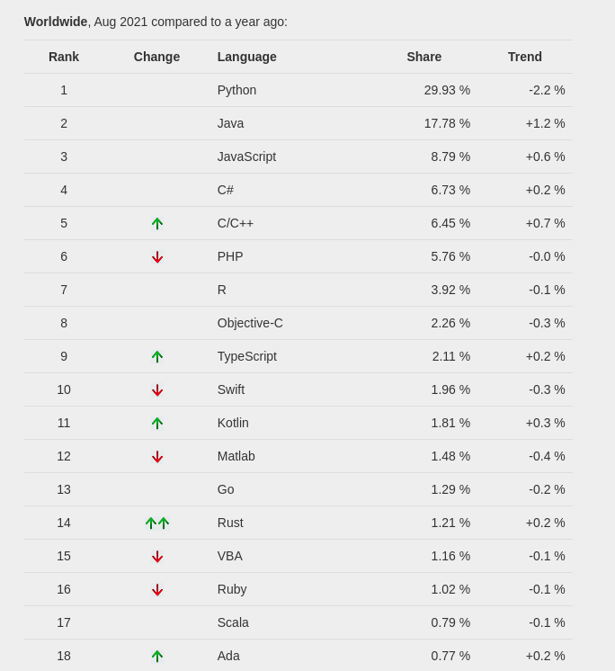
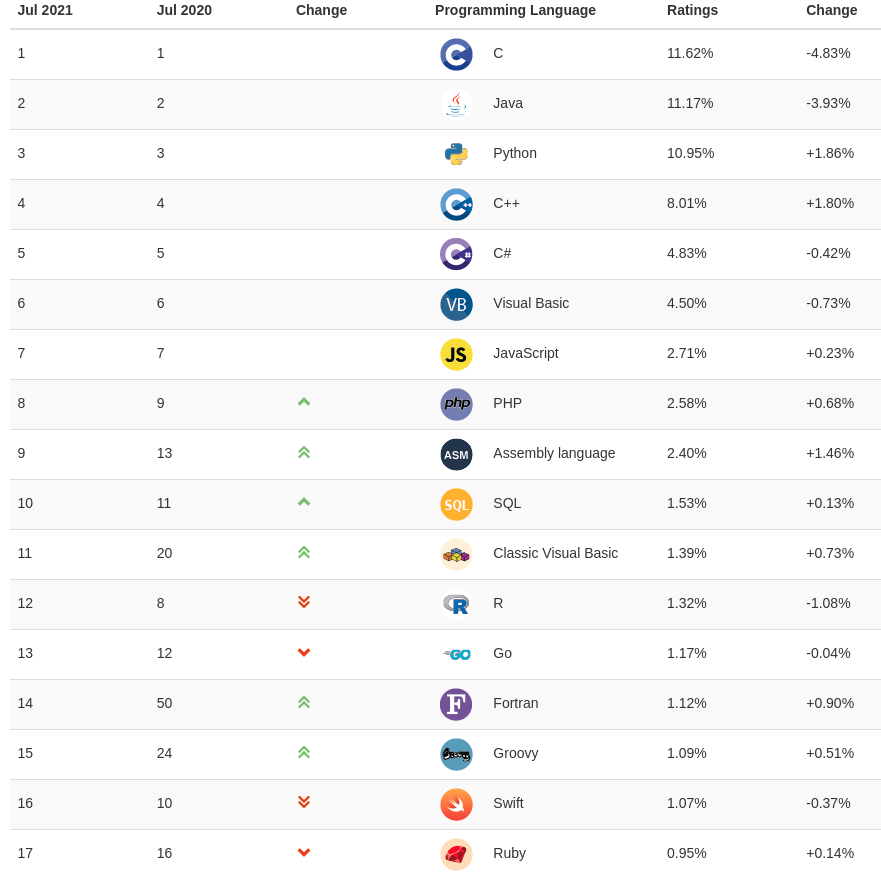
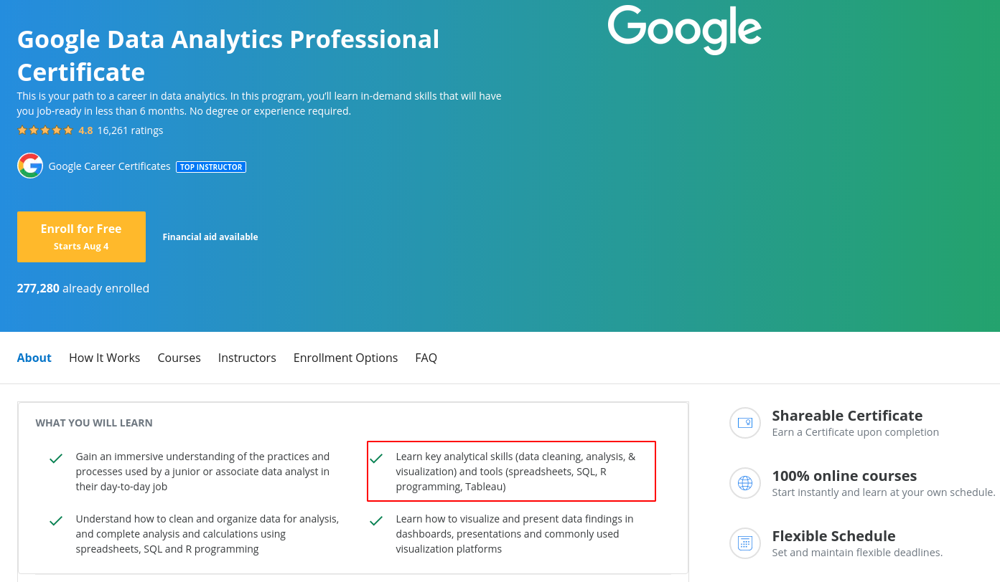

```{r setup, include=FALSE}
options(htmltools.dir.version = FALSE)
```

```{r slide-setup, include=FALSE}
knitr::opts_chunk$set(echo = TRUE, 
                      fig.retina = 2, 
                      dpi = 300,
                      fig.align = "center")
```

```{r variables, include=FALSE}
year <- format(Sys.time(), "%Y")
```

```{r functions, include=FALSE}
put_image <- function(name){
 img <- file.path("img", name)
 knitr::include_graphics(img)
}
```

class: title-slide, center, middle

#.title[Introduzione a R]

<br/>

```{r, out.width="10%", echo = FALSE}
knitr::include_graphics(path = "img/tidyverse.svg")
```

#.subtitle[Giornata 1]

###.location[Corsi ARCA `r year` - @DPSS]

###.author[Filippo Gambarota]

---
class: section, center, middle

# In cosa consiste questo corso?

---
# Gli obiettivi principali

- Impareremo tutti gli **elementi principali** che compongono il linguaggio R
- Impareremo i **costrutti della programmazione** e la loro applicazione in R
- Impareremo a **impostare un progetto** in R

---
# Altri obiettivi importanti

- Imparare la .imp[logica generale della programmazione] spendibile con qualsiasi linguaggio
- Imparare gli elementi di base per poi stare al passo con la .imp[velocissima evoluzione di R]
- Migliorare il modo di affrontare i problemi e .imp[rendere più efficiente il lavoro quotidiano]

---
class: section, center, middle

# Organizzazione pratica

---
# Il materiale principale

- Libro [**Introduction2R**](https://psicostat.github.io/Introduction2R/) disponibile online su Github `r icons::fontawesome("github")`

- Slide del corso (principalmente per supportare le lezioni)

- Altra documentazione, link e materiale collegato

---
# Organizzazione delle lezioni

Il miglior modo per imparare un linguaggio è sicuramente la pratica con dati o piccoli problemi da risolvere. E' anche importante però avere una comprensione teorico-logica dei vari argomenti per poter essere più autonomi possibile.

- Presentazione degli argomenti principali con gli aspetti teorici più importanti
- Applicazione direttamente scrivendo codice
- Comprensione dei risultati del codice, dei messaggi di errore e dei casi particolari

---
# Materiale di supporto

- Il materiale del corso (principalmente scripts, slides e link) sarà disponibile alla pagina Github: [filippogambarota/corsoR](https://github.com/filippogambarota/corsoR)
- Il materiale e i vari link sono facilmente consultabili nel [sito associato](https://filippogambarota.github.io/corsoR/).

---
# Un cenno al libro

Il libro è disponibile online ed è interamente scritto in R (si si possono scrivere anche libri `r emo::ji("smile")`). Il libro è in costante *work in progress* in base a errori, feedback e aggiornamenti stessi di R.

Il libro è nato da un'idea del mio amico e collega Claudio Zandonella Callegher ed io ho contribuito in alcune sezioni. 

Potete attivamente contribuire allo sviluppo del libro fornendoci:

- suggerimenti
- **segnalare errori**
- segnalare parti non chiare

---
# Segnalare errori libro

In particolare, errori di scrittura o imprecisioni sono le cose più importanti. Per questo ho pensato ad un modo efficiente per gestire il tutto. Trovate istruzioni dettagliate [qui](https://filippogambarota.github.io/corsoR/), in breve:

- trovate un errore o imprecisione
- aprire il [documento condiviso](https://docs.google.com/spreadsheets/d/1YmXN3iDtiyfLkhW246cICC_4X8S7xqWuN-EiLVDiAT8/edit#gid=0)
- riportare tutti i dettagli
- sentirsi soddisfatti `r emo::ji("smile")`
---
class: section, center, middle

# Che cos'è R

---
# `r icons::simple_icons("r")`

[**R**](https://www.r-project.org/) è un linguaggio di programmazione fortemente votato alla statistica, gestione di dati e visualizzazione.

E' nato nel 1993 da .imp[Ross Ihaka] e .imp[Robert Gentleman] come successore di un'altro linguaggio chiamato **S**.

E' un software completamente **open-source** e **gratuito** in continua evoluzione e cambiamento.

---
class: section, center, middle

# Perchè R

---
# Qualche statistica

.pull-left[

```{r, out.width="70%"}

```

]

.pull-right[

```{r, out.width="70%"}

```

]

.footnote[

[PYPL](https://pypl.github.io/PYPL.html) and [TIOBE](https://www.tiobe.com/tiobe-index/) index
]

---
# Qualche statistica

```{r}
knitr::include_url("https://cran.r-project.org/web/packages/#:~:text=Currently%2C%20the%20CRAN%20package%20repository%20features%2017951%20available%20packages.")
```

---
# E se lo dice Google `r emo::ji("smile")`

```{r, out.width="80%"}

```

---
# Un cenno all'open-source

Un software si definisce open-source quando il codice sorgente è disponibile a tutti per essere modificato, aggiornato e controllato.

Open-source non significa necessariamente **gratuito** ma è sicuramente una delle modalità migliori per sviluppare e mantenere un progetto software.

R è sia open-source che gratuito e vanta una community estremamente attiva, come spesso accade con tutti i progetti open-source e in generale i linguaggi di programmazione.

---
# Quale è la concorrenza?

Il principale "concorrente" di R è sicuramente **Python** che offre un ambiente altrettanto potente, sviluppato e attivo

Non è facile (e forse non è possibile) capire quale sia il migliore. Sicuramente se produrre grafici, gestire dati e fare analisi statistiche è la priorità, R è la scelta più adeguata.

Una volta imparato R, Python in ogni caso è molto semplicee può essere utile per altri scopi come:

- Elaborazione immagini
- Creare esperimenti (Psychopy)

---
# Quale NON è la concorrenza?

Nell'ambito della statistica ci sono vari software non open-source ed a pagamento come:

- Statistica
- SPSS
- STATA
- SAS

---
# Quale NON è la concorrenza?

Sono degli ottimi software ma:

- Non forniscono conoscenze trasversali
- Siete legati ad uno specifico ambiente
- Le licenze possono costare molto
- La community non è altrettanto attiva (non open-source)

---
# Imparare un linguaggio come investimento

Imparare in linguaggio come R vi permette di conoscere uno strumento molto potente ma anche di imparare:

- Ragionare e risolvere problemi con il codice
- Trasferire quello che avete imparato ad altri linguaggi
- Essere sempre autonomi e non legati ad uno specifico ambiente
- Avere una skill realmente di valore

---
# R come una lingua parlata

Una lingua è composta da:

- regole grammaticali: **cosa è giusto/sbagliato**
- influenze ed evoluzioni culturali: **la lingua cambia ed evolve**
- slang ed espressioni tipiche
- convenzioni e best practice

---
# R come una lingua parlata

Anche in R, come in tutti i linguaggi di programmazione sono presenti questi aspetti. Questa metafora del linguaggio di programmazione come lingua parlata vorrei che stesse con noi per tutto il corso perchè molto utile per avere una visione d'insieme.

---


