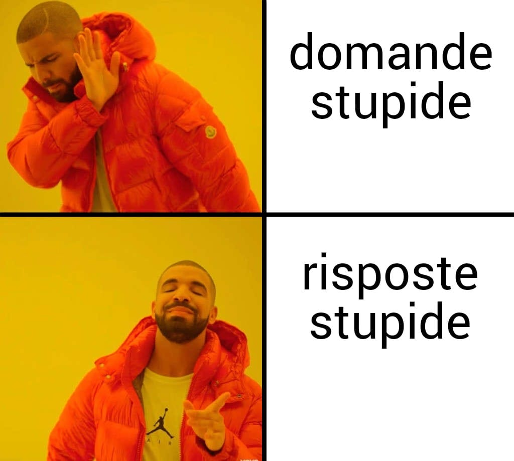
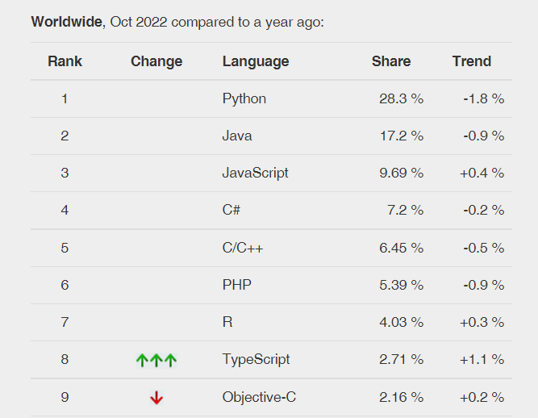
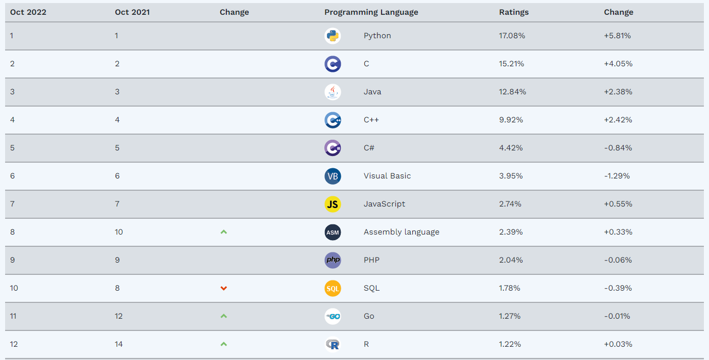
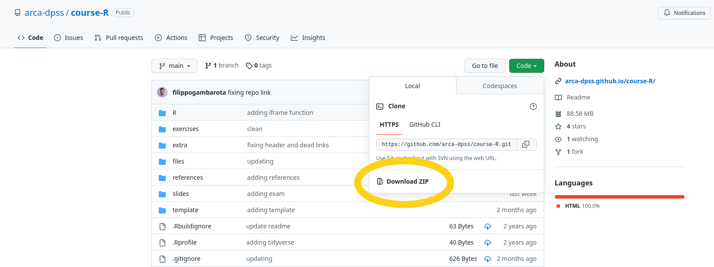
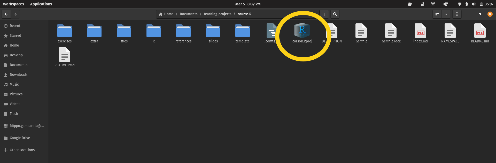
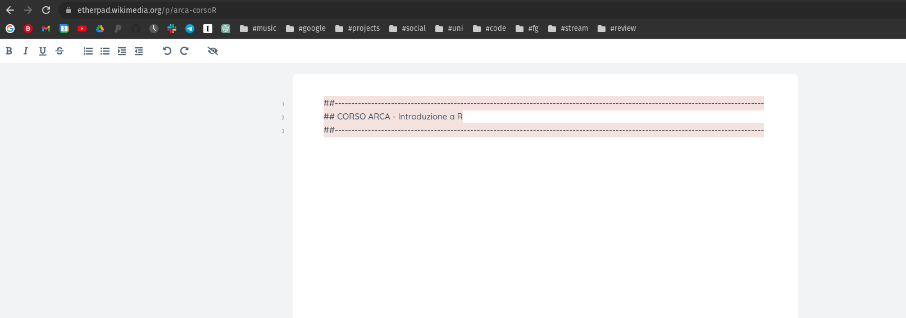

```{r setup, include=FALSE}
options(htmltools.dir.version = FALSE,
        crayon.enabled = TRUE)
```

```{r slide-setup, include=FALSE}
knitr::opts_chunk$set(echo = FALSE, 
                      fig.retina = 2, 
                      dpi = 300,
                      sdev = "svg",
                      warning = FALSE,
                      message = FALSE,
                      fig.align = "center")
```

```{r packages}
library(tidyverse)
devtools::load_all()
```

class: title-slide, center, middle

#.title[`r rmarkdown::metadata$title`]

#.subtitle[`r rmarkdown::metadata$subtitle`]

```{r, out.width="10%", echo = FALSE}
knitr::include_graphics(path = "img/arca_logo.svg")
```

###.location[ARCA - @DPSS]

###.author[`r rmarkdown::metadata$author`]

---
class: section, center, middle

# In cosa consiste questo corso?

---
# Gli obiettivi principali

- Impareremo tutti gli **elementi principali** che compongono il linguaggio R
- Impareremo i **costrutti della programmazione** e la loro applicazione in R
- Impareremo a **impostare un progetto** in R

`r iframe("https://giphy.com/embed/75ZaxapnyMp2w", 300, 300)`

---
# Altri obiettivi importanti

- Imparare la .imp[logica generale della programmazione] spendibile con qualsiasi linguaggio
- Imparare gli elementi di base per poi stare al passo con la .imp[velocissima evoluzione di R]
- Migliorare il modo di affrontare i problemi e .imp[rendere più efficiente il lavoro quotidiano]

`r iframe("https://giphy.com/embed/26BoDGStUAafwdZII", 300, 300)`

---
class: section, center, middle

# Organizzazione pratica

---
# Il materiale principale

- Libro [**Introduction2R**](https://psicostat.github.io/Introduction2R/) disponibile online su Github `r icons::fontawesome("github")`

- Repository Github del corso `r link("https://github.com/arca-dpss/course-R")` accessibile anche al sito web `r link("https://arca-dpss.github.io/course-R")`

- Altra documentazione, link e materiale collegato

---
# Organizzazione delle lezioni

Il miglior modo per imparare un linguaggio è sicuramente la **pratica con dati o piccoli problemi da risolvere**. E' anche importante però avere una **comprensione teorico-logica dei vari argomenti** per poter essere più autonomi possibile.

--

- Presentazione degli argomenti principali con gli aspetti teorici più importanti
- Applicazione direttamente scrivendo codice
- Comprensione dei risultati del codice, dei messaggi di errore e dei casi particolari

---
# Materiale di supporto

- Il materiale del corso (principalmente scripts, slides e link) sarà disponibile alla pagina Github `r icons::fontawesome("github")`: [arca-dpss/course-R](https://github.com/arca-dpss/course-R)
- Il materiale e i vari link sono facilmente consultabili nel [sito associato](https://arca-dpss.github.io/course-R/).

---
# Un cenno al libro

Il libro è disponibile online ed è interamente scritto in R (si si possono scrivere anche libri `r emo::ji("smile")`). Il libro è in costante *work in progress* in base a errori, feedback e aggiornamenti stessi di R.

Il libro è nato da un'idea del mio amico e collega Claudio Zandonella Callegher ed io ho contribuito in alcune sezioni. 

Potete attivamente contribuire allo sviluppo del libro fornendoci:

.pull-left[

- suggerimenti
- **segnalare errori**
- segnalare parti non chiare

]

.pull-right[

`r iframe("https://giphy.com/embed/FaMmrCXe5zx2QZfkh6", 200, 200)`

]

---
# Segnalare errori libro

In particolare, errori di scrittura o imprecisioni sono le cose più importanti. Per questo ho pensato ad un modo efficiente per gestire il tutto. Trovate istruzioni dettagliate [qui](https://filippogambarota.github.io/corsoR/), in breve:

.pull-left[

- trovate un errore o imprecisione
- aprire il [documento condiviso](https://docs.google.com/spreadsheets/d/1YmXN3iDtiyfLkhW246cICC_4X8S7xqWuN-EiLVDiAT8/edit#gid=0)
- riportare tutti i dettagli
- sentirsi soddisfatti `r emo::ji("smile")`

]

.pull-right[

`r iframe("https://giphy.com/embed/FaMmrCXe5zx2QZfkh6", 200, 200)`

]

---
# Rules of the game

```{r, out.width="50%", fig.align='center'}

```

---
class: section, center, middle

# Esame 😱

---
# Esame 😱

- Consiste in **20 domande** a scelta multipla con una sola risposta corretta
- **45 minuti** a disposizione
- I punteggi sono assegnati con la seguente modalità:
    - **1 punto** per ogni **risposta corretta**
    - **-0.33 punti** per ogni **risposta sbagliata**
    - **0 punti** per ogni **risposta non data**
- Per superare l'esame è necessario ottenere **almeno 15 punti (75%) sul totale di 20 punti**.

---
class: section, center, middle

# Che cos'è R

---
# `r icons::simple_icons("r")`

[**R**](https://www.r-project.org/) è un linguaggio di programmazione fortemente votato alla statistica, gestione di dati e visualizzazione.

E' nato nel 1993 da .imp[Ross Ihaka] e .imp[Robert Gentleman] come successore di un'altro linguaggio chiamato **S**.

E' un software completamente **open-source** e **gratuito** in continua evoluzione e cambiamento.

---
class: section, center, middle

# Perchè R

---
# Qualche statistica

```{r, out.width="50%"}

```

.footnote[
[PYPL](https://pypl.github.io/PYPL.html)
]

---
# Qualche statistica

```{r, out.width="80%"}

```

.footnote[
[TIOBE](https://www.tiobe.com/tiobe-index/)
]

---
# CRAN

```{r}
knitr::include_url("https://cran.r-project.org/web/packages/#:~:text=Currently%2C%20the%20CRAN%20package%20repository%20features%2017951%20available%20packages.")
```

---
# E se lo dice Google `r emo::ji("smile")`

```{r, out.width="80%"}

```

---
# Un cenno all'open-source

Un software si definisce open-source quando il **codice sorgente è disponibile** a tutti per essere **modificato**, **aggiornato** e **controllato**.

--

R è **sia open-source che gratuito** e vanta una community estremamente attiva, come spesso accade con tutti i progetti open-source e in generale i linguaggi di programmazione.

--

`r iframe("https://giphy.com/embed/ajTYvLVDxbT1sbgMlI", 300, 300)`


---
# Quale è la concorrenza?

Il principale "concorrente" di R è sicuramente **Python** che offre un ambiente altrettanto potente, sviluppato e attivo

Non è facile (e forse non è possibile) capire quale sia il migliore. Sicuramente se produrre grafici, gestire dati e fare analisi statistiche è la priorità, R è la scelta più adeguata.

Una volta imparato R, Python in ogni caso è molto semplicee può essere utile per altri scopi come:

- Elaborazione immagini
- Creare esperimenti (Psychopy)

---
# Quale NON è la concorrenza?

Nell'ambito della statistica ci sono vari software non open-source ed a pagamento come:

.pull-left[

- Statistica
- SPSS
- STATA
- SAS

]

.pull-right[

`r iframe("https://giphy.com/embed/LBCnioHLnPwpqBjGhI", 300, 300)`

]

---
# Quale NON è la concorrenza?

Sono degli ottimi software ma:

- Non forniscono conoscenze trasversali
- Siete legati ad uno specifico ambiente
- Le licenze possono costare molto
- La community non è altrettanto attiva (non open-source)

---
# Quali sono delle alternative?

Ci sono degli ottimo software open-source basati su R come:

- [Jamovi](https://www.jamovi.org/)
    - **pros**: si può accedere al codice R sottostante
    - **cons**: le funzioni sono comunque limitate, grafici, modelli complessi
- [Jasp](https://jasp-stats.org/)
    - **pros**: molti modelli anche avanzati
    - **cons**: non si può vedere il codice R

In generale, sono buone opzioni MA credo sia sempre meglio imparare il linguaggio.

---
# Imparare un linguaggio come investimento

Imparare in linguaggio come R vi permette di conoscere uno strumento molto potente ma anche di imparare:

- Ragionare e risolvere problemi con il codice
- Trasferire quello che avete imparato ad altri linguaggi
- Essere sempre autonomi e non legati ad uno specifico ambiente
- Avere una skill realmente di valore

---
# Imparare R è difficile...MA ne vale la pena!

```{r}
spss_curve <- function(x) sqrt(x*200)
r_curve <- function(x) sqrt(x*30)

ggplot(data = data.frame(x = 0), mapping = aes(x = x)) + 
  stat_function(fun = spss_curve, aes(color = "SPSS"), size = 1.5) +
  stat_function(fun = r_curve, aes(color = "R"), size = 1.5) +
  xlim(0, 100) +
  ylim(0, 100) +
  cowplot::theme_minimal_grid() +
  xlab("ORE TOTALI") +
  ylab("SKILLS") +
  theme(axis.text.x = element_blank(),
        legend.title = element_blank(),
        aspect.ratio = 1,
        plot.title = element_text(hjust = 0.5)) +
  ggtitle("Apprendimento iniziale") -> learning_r_plot


after_spss <- function(x) sqrt(x*5)

ggplot(data = data.frame(x = 0), mapping = aes(x = x)) + 
    stat_function(fun = function(x) sqrt(x*150), aes(color = "After R"), size = 1.5) +
    stat_function(fun = after_spss, aes(color = "After SPSS"), size = 1.5) +
    xlim(0, 100) +
    ylim(0, 100) +
    cowplot::theme_minimal_grid() +
    xlab("ORE TOTALI") +
    ylab("SKILLS") +
    theme(axis.text.x = element_blank(),
          legend.title = element_blank(),
          aspect.ratio = 1,
          plot.title = element_text(hjust = 0.5)) +
    ggtitle("Apprendimento di altri linguaggi") +
    scale_color_manual(values = c("red", "grey")) -> after_r_plot
```

--

.pull-left[
```{r}
learning_r_plot
```
]

--
.pull-right[
```{r}
after_r_plot
```
]
---
# R come una lingua parlata

Una lingua è composta da:

- regole grammaticali: **cosa è giusto/sbagliato**
- influenze ed evoluzioni culturali: **la lingua cambia ed evolve**
- slang ed espressioni tipiche
- convenzioni e best practice

---
# Let's start `r emo::ji("sunglasses")`

`r iframe("https://giphy.com/embed/lluj1cauAlO2vQEm8A", 500, 500)`

---
class: section, center, middle

# Prepariamoci!

---
# Prepariamoci!

Andate su https://github.com/arca-dpss/course-R, e scaricate la repository. **Salvate anche nei preferiti** il link alla repository perchè la useremo spesso.

```{r, echo = FALSE, out.width="100%"}

```
---
# Prepariamoci!

Vi consiglio di lavorare sempre su questa cartella in modo che impariate a lavorare con i progetti R.

```{r, echo = FALSE, out.width="100%"}

```

---
# Prepariamoci!

Aprite e tenete aperto questo link https://etherpad.wikimedia.org/p/arca-corsoR

```{r, echo = FALSE, out.width="100%"}

```