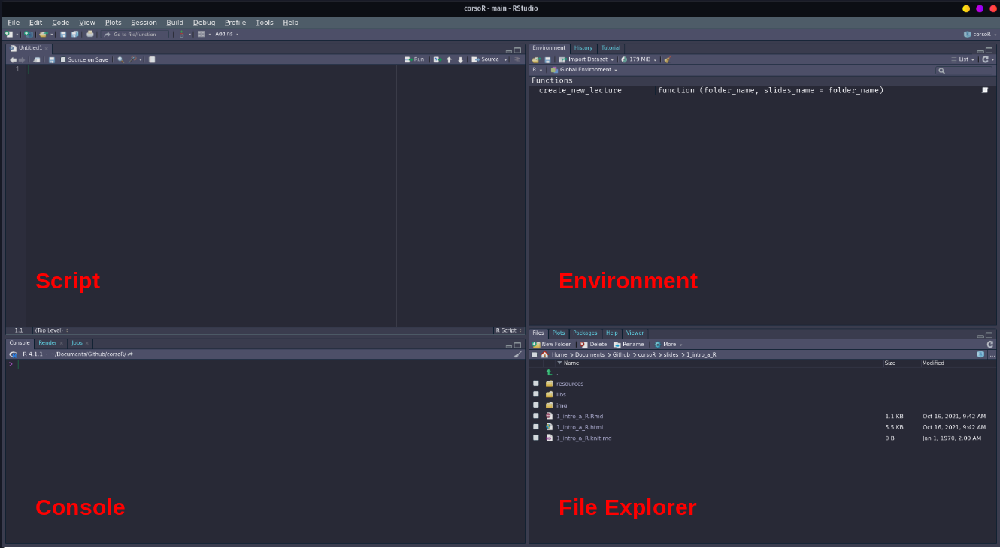
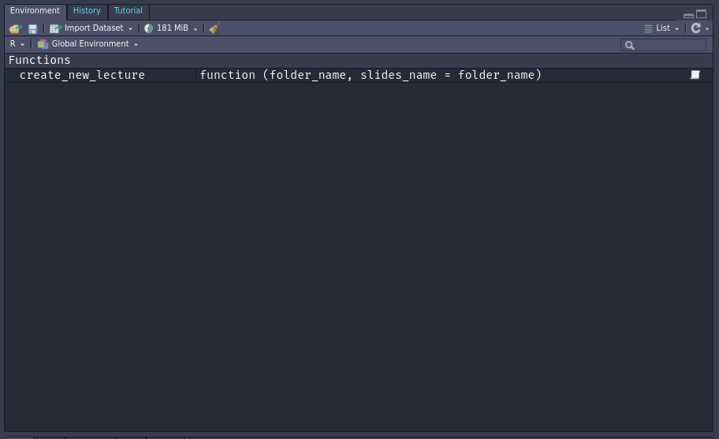
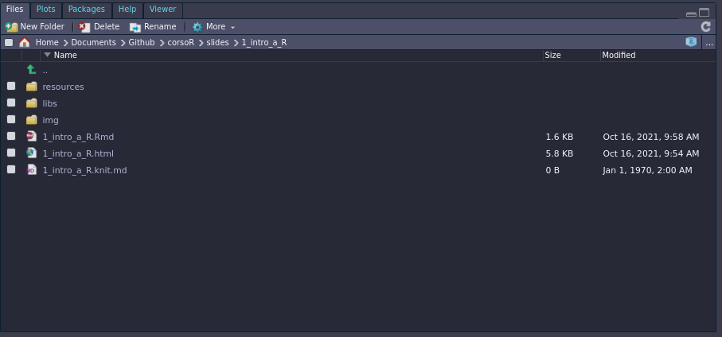
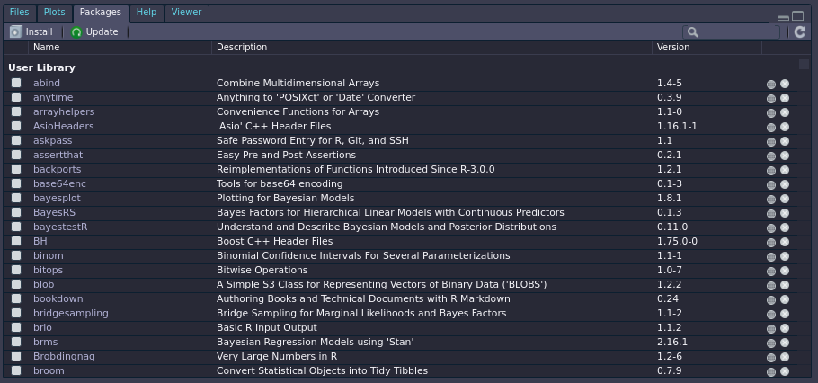
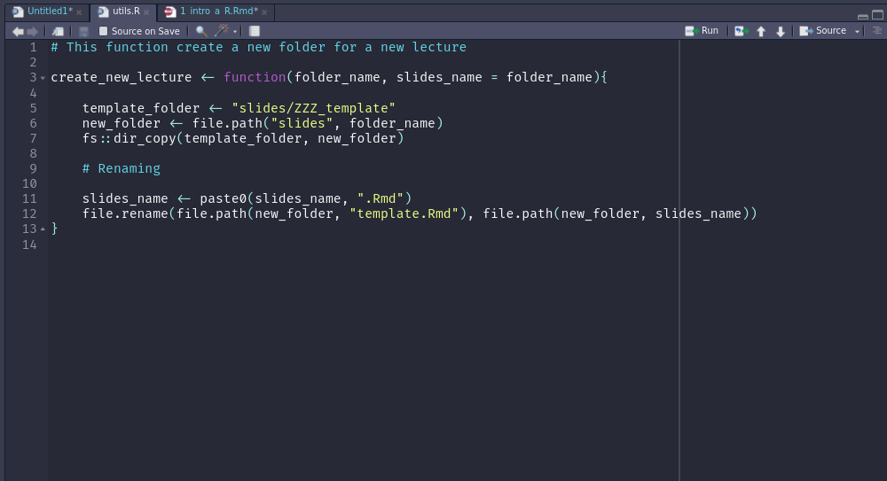

```{r setup, include=FALSE}
options(htmltools.dir.version = FALSE)
```

```{r slide-setup, include=FALSE}
knitr::opts_chunk$set(echo = TRUE, 
                      fig.retina = 2, 
                      dpi = 300,
                      fig.align = "center")
```

```{r variables, include=FALSE}
year <- format(Sys.time(), "%Y")
```

```{r functions, include=FALSE}
put_image <- function(name){
 img <- file.path("img", name)
 knitr::include_graphics(img)
}
```

class: title-slide, center, middle

#.title[Introduzione a R]

#.subtitle[Giornata 1]

```{r, out.width="10%", echo = FALSE}
knitr::include_graphics(path = "img/tidyverse.svg")
```


###.location[Corsi ARCA - @DPSS]

###.author[Filippo Gambarota]

---
class: section, center, middle

# Primi passi con R

---
# Installazione

Per l'installazione trovate le indicazioni nella sezione [Installare R e RStudio](https://psicostat.github.io/Introduction2R/install.html) del libro. In generale i passaggi sono:

- scaricare R e installare **R** per il vostro sistema operativo
- scaricare e installare **RStudio**

---
class: section, center, middle

# Come si presenta R

---

# Console

```{r}
put_image("R_console.png")
```

# RStudio

```{r}

```

---
class: section, center, middle

# I primi passi in R

---
# R come calcolatrice

In R è possibile effettuare tutte le operazioni matematiche e algebriche dalle più semplici alle più avanzate

---
# R e gli oggetti

> “Everything that exists in R is an object” - John Chambers

Il concetto di **oggetto** è fondamentale in R. Essenzialmente tutto quello che possiamo creare o utilizzare in R come un numero, un insieme di numeri, dei caratteri o delle funzioni sono creati come oggetti.

---
# R e gli oggetti

- Come creare un oggetto?
- Oggetti e nomi
- Dove viene creato l'oggetto?
- Principali tipologie di oggetti

---
# Convenzioni vs regole

Ci sono alcune cose da considerare quando si scrive codice ed in particolare si creano oggetti:

- **alcune modalità sono errate** --> R ci fornisce un messaggio di errore
- **alcune modalità sono sconsigliate** --> funziona tutto ma ci potrebbero essere problemi
- **alcune modalità sono stilisticamente errate** --> funziona tutto, nessun problema ma... anche l'occhio vuole la sua parte

---
class: section, center, middle

# Ambiente di lavoro

---
# Ambiente di lavoro

- ### Environment

- ### Working directory

- ### Packages

---
# Environment

Il **working environment** è la vostra *scrivania* quando lavorate in R. Contiene tutti gli oggetti (variabili) creati durante la sessione di lavoro.

```{r}

```

---
# Working Directory

La working directory è la posizione (cartella) sul vostro PC dove R sta lavorando e nella quale R si aspetta di trovare i vostri file, se non specificato altrimenti

```{r}

```

---
# Packages

In R è possibile installare e caricare pacchetti aggiuntivi che non fanno altro che rendere disponibili librerie di funzioni create da altri utenti. Per utilizzare un pacchetto:

- Installare il pacchetto con `install.packages("nomepacchetto")`
- Caricare il pacchetto con `library(nomepacchetto)`

```{r}

```

---
class: section, center, middle

# Come lavorare in R

---

# Scrivere e organizzare script

- Lo script è un file di testo dove il codice viene salvato e puo essere lanciato in successione
- Nello script è possibile combinare **codice** e **commenti**

```{r}

```

---

# R Projects

Gli `R projects` sono una feature implementata in R Studio per organizzare una cartella di lavoro

- permettono di impostare la **working directory** in automatico
- permettono di usare **relative path** invece che **absolute path**
- rendono più **riproducibile** e **trasportabile** il progetto
- permettono un **veloce accesso** ad un determinato progetto

---
class: section, center, middle

# Come risolvere i problemi ~~nella vita~~ in R

---
# Come risolvere i problemi ~~nella vita~~ in R

In R gli errori sono:

- inevitabili
- parte del codice stesso
- educativi

Resta solo da capire come affrontarli

---
# R ed errori

Ci sono diversi livelli di **allerta** quando scriviamo codice:

- **messaggi**: la funzione ci restituisce qualcosa che è utile sapere, ma tutto liscio
- **warnings**: la funzione ci informa di qualcosa di *potenzialmente* problematico, ma (circa) tutto liscio
- **error**: la funzione non solo ci informa di un **errore** ma le operazioni richieste non sono state eseguite

---
# Come risolvere un errore?

- capire il messaggio
- leggere la documentazione della funzione
- cercare il messaggio su Google
- chiedere aiuto nei forum dedicati

---
# Come risolvere un errore?

- Ogni funzione ha una pagina di documentazione accessibile con `?nomefunzione` o `??nomefunzione`
- Possiamo cercare anche la documentazione del pacchetto
- Possiamo cercare su Google il nome della funzione o l'eventuale messaggio che riceviamo