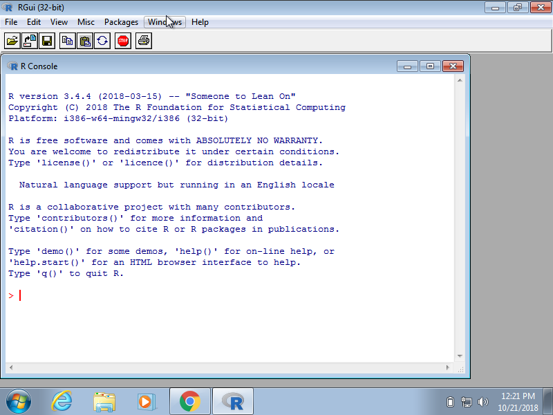
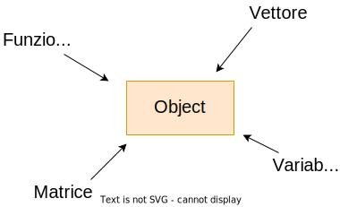
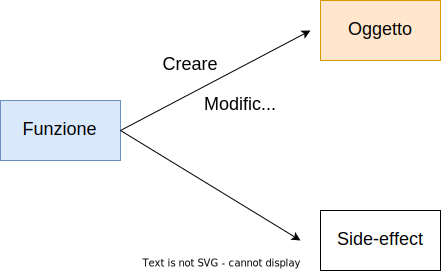
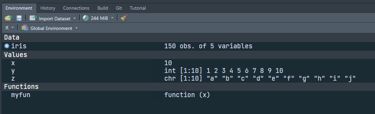
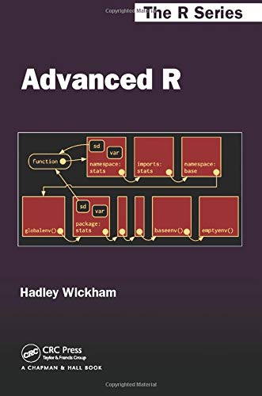
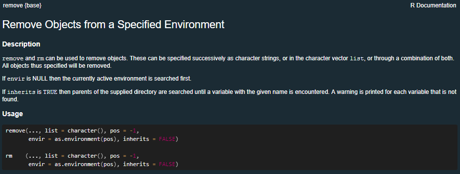

```{r setup, include=FALSE}
options(htmltools.dir.version = FALSE,
        crayon.enabled = TRUE)
```

```{r slide-setup, include=FALSE}
knitr::opts_chunk$set(echo = TRUE, 
                      fig.retina = 2, 
                      dpi = 300,
                      fig.align = "center")
```

```{r packages, include = FALSE}
library(kableExtra)
devtools::load_all()
```

```{r xaringanExtra-clipboard, echo=FALSE}
xaringanExtra::use_clipboard()
```

class: title-slide, center, middle

#.title[`r rmarkdown::metadata$title`]

#.subtitle[`r rmarkdown::metadata$subtitle`]

```{r, out.width="10%", echo = FALSE}
knitr::include_graphics(path = "img/arca_logo.svg")
```

###.location[`r rmarkdown::metadata$institute`]

###.author[`r rmarkdown::metadata$author`]

---
class: section, center, middle

# Primi passi con R

---
# Installazione

Per l'installazione trovate le indicazioni nella sezione [Installare R e RStudio](https://psicostat.github.io/Introduction2R/install.html) del libro. In generale i passaggi sono:

- scaricare R e installare **R** per il vostro sistema operativo
- scaricare e installare **RStudio**

---
class: section, center, middle

# Come si presenta R

---

# Console

```{r, echo = FALSE, out.width="60%"}

```

---

# RStudio

```{r, echo = FALSE, out.width="90%"}
knitr::include_graphics("img/rstudio.png")
```

---
class: section, center, middle

# I primi passi in R

---
# R come calcolatrice

In R è possibile effettuare tutte le [operazioni matematiche](https://psicostat.github.io/Introduction2R/first-comands.html#math-operators) e algebriche dalle più semplici alle più avanzate

```{r, echo = FALSE}
names_function <- c("Addizione", "Sottrazione", "Moltiplicazione", "Divisione",
                    "Resto della divisione", "Divisione intera", "Potenza",
                    "Valore assoluto","Segno di un'espressione", "Radice quadrata", 
                    "Logaritmo naturale", "Esponenziale", "Funzioni trigonometriche",
                    "Fattoriale", "Coefficiente binomiale") 


math_operators <- data.frame(
    formula = c(sprintf("x %s y", c("+", "-", "*", "/", "%%", "%/%", "^")),
                sprintf("%s(x)", c("abs", "sign", "sqrt", "log", "exp")),
                paste0(sprintf("%s(x)", c("sin", "cos", "tan", "asin", "acos", "atan")),
                       collapse = "<br />"),
                "factorial(x)", "choose(n, k)"),
    name = names_function,
    example = c(sprintf("> %s <br />[1] %s",
                        c("5 + 3", "7 - 2", "4 * 3", "8 / 3", "7 %% 5", "7 %/% 5", 
                          "3 ^ 3","abs(3-5^2)", "sign(-8)", "sqrt(25)", "log(10)", "exp(1)"),
                        c("8", "5", "12", "2.666667", "2", "1", "27","22", "-1", "5",
                          "2.302585", "2.718282")),
                ">sin(pi/2) <br />[1]1 <br />>cos(pi/2) <br />[1]6.123234e-17",
                c(sprintf("> %s <br />[1] %s",
                          c("factorial(6)", "choose(5,3)"),
                          c("720", "10"))))
)

kableExtra::kable(math_operators, col.names = c("Funzione", "Nome", "Esempio"),
                  escape = FALSE) %>%
    kable_styling(bootstrap_options = c("striped", "hover", "condensed", "responsive"),
                  full_width = T) %>% 
    scroll_box(width = "1000px", height = "400px")
```

---
# Operatori matematici

- Importante considerare l'**ordine delle operazioni** analogo alle regole della matematica: `2 x 3 + 1` prima `2 x 3` e poi `+ 1`. Analogalmente in R:

```{r, echo = TRUE}

# Senza parentesi

2 * 3 + 1

# Con le parentesi

(2 * 3) + 1

# Con le parentesi forzando un ordine diverso

2 * (3 + 1)

```

---
# Operatori relazionali

Gli operatori relazionali sono molto utili dentro le **funzioni**, per **selezionare elementi dalle strutture dati** (vedremo più avanti) e in generale per **controllare** alcune sezioni del nostro codice:

.pull-left[

```{r, echo = TRUE}
3 > 4

3 >= 3

10 < 100
```

]

.pull-right[

```{r, echo=TRUE}
40 == 40

10 != 50
```

]

---
# Operatori logici

Gli operatori logici permettono di **combinare espressioni relazionali** e ottenere sempre un valore `TRUE` o `FALSE`:

```{r, echo = TRUE}
3 > 4 & 10 < 100

10 < 100 | 50 > 2

!5 > 4
```

---
class: section, center, middle

# R e gli oggetti

---
# R e gli oggetti

> “Everything that exists in R is an object” - John Chambers

Il concetto di **oggetto** è fondamentale in R. Essenzialmente tutto quello che possiamo creare o utilizzare in R come un numero, un vettore, dei caratteri o delle funzioni sono creati come oggetti.

```{r, echo = FALSE}

```

---
# R e le funzioni

> “Everything that happen in R is a function call” - John Chambers

Anche il concetto di **funzione** è fondamentale in R. Essenzialmente tutto quello che facciamo è chiamare **funzioni** su oggetti ottenendo un nuovo oggetto o modificando un oggetto esistente

```{r, echo = FALSE}

```

---
# Cosa possiamo usare/creare in R?

- **Numeri**: 100, 20, 6, 5.6 sono tutti numeri intepretati e trattati come tali
- **Stringhe**: "ciao", "1" sono *caratteri* che vengono intepretati letteralmente devono essere dichiarati con `""`
- **Nomi**: ciao, x sono nomi (senza virgolette) e sono utilizzati per essere associati ad un oggetto (variabile, funzione, etc.)
    - **operatori**: sono delle funzioni (e quindi oggetti con un nome associato) che si utilizzano in modo particolare. `3 + 4` in questo caso `+` è un operatore (funzione) che si può usare anche come `+`(3, 4)

---
# R e gli oggetti

- Come creare un oggetto?
- Oggetti e nomi
- Dove viene creato l'oggetto?
---
# Come creare un oggetto?

La creazione di un oggetto avviene tramite il comando `<-` oppure `=` in questo modo: `nome <- oggetto`:

```{r, echo = TRUE, error=TRUE}
x

10 # questo non è un oggetto, non è salvato

x <- 10 # ora il valore numerico 10 è associato al nome "x"

x
```

---
# Convenzioni vs regole

Ci sono alcune cose da considerare quando si scrive codice ed in particolare si creano oggetti:

- **alcune modalità sono errate** --> R ci fornisce un messaggio di errore
- **alcune modalità sono sconsigliate** --> funziona tutto ma ci potrebbero essere problemi
- **alcune modalità sono stilisticamente errate** --> funziona tutto, nessun problema ma... anche l'occhio vuole la sua parte

---
# Oggetti e nomi

Il nome di un oggetto è importante sia per l'utente che per il software stesso:

```{r, echo = TRUE, error=TRUE}

1 <- 10 # errore

_ciao <- 10 # errore

mean <- 10 # possibile ma pericoloso

`1` <- 10 # con i backticks si può usare qualsiasi nome ma poco pratico

```

```{r, echo=TRUE}

my_obj <- 10

my.obj <- 10

My_obj <- 10 # attenzione a maiuscole e minuscole
```

---
# Oggetti e nomi (proibiti)

In R ci sono anche dei nomi non solo sconsigliati ma proprio **proibiti** che nonostante siano sintatticamente corretti, non possono essere usati (per ovvie ragioni):

.pull-left[

```{r, error = TRUE, echo=TRUE}

mean <- 10 # ok ma sconsigliato

function <- 10
```

]

.pull-right[

```{r, echo = TRUE, error = TRUE}
TRUE <- 4

T <- 2 # attenzione
```

]

---
# Dove viene creato l'oggetto?

Di default gli oggetti sono creati nel **global environment** accessibile con `ls()` o visibile in R Studio con anche alcune informazioni aggiuntive:

```{r, echo = FALSE, out.width="90%"}

```

---
class: section, center, middle

# Non solo numeri (anticipazione)

---

# Non solo numeri (anticipazione)

In R possiamo usare oltre ai numeri (in senso matematico) anche le **stringhe** ovvero parole, lettere intepretate così come sono:

```{r, echo = TRUE, error = TRUE}

"ciao" # stringa formata da 5 caratteri

x <- "ciao" # associo la stringa ad un oggetto

x + 1 # operazioni matematiche con stringhe (ha senso?)

x == "ciao"

x > 10

```

---
class: section, center, middle

# Funzioni

---
# Funzioni

Le funzioni sono un argomento relativamente complesso ed avanzato. Lo tratteremo più avanti nella sezione [Funzioni](https://arca-dpss.github.io/course-R/slides/4_programmazione/4_programmazione.html#6) del capitolo Programmazione in R. Siccome le usiamo fin da subito è importante avere chiari alcuni aspetti:

- Funzioni come oggetti
- Argomenti obbligatori, opzionali e default
- Ordine degli argomenti
- Documentazione

---
# Funzioni come oggetti

Abbiamo già visto che ogni cosa in R è un oggetto. Anche le funzioni seppur molto diverse da altri elementi sono creati e trattati in R come oggetti:

```{r}
myfun <- function(x) {
  return(x + 3)
}

ls()
```

Possiamo crearle, eliminarle o sovrascriverle come un normale oggetto. Vedremo più avanti come crearle ma tenete in considerazione che tutte le funzioni che usiamo sono create come oggetti e salvati nell'ambiente (quando facciamo `library()` sono rese disponibili)

---
# Argomenti

Gli argomenti delle funzioni sono quelli che da *utenti* dobbiamo conoscere ed impostare nel modo corretto per fare in modo che la funzioni faccia quello per cui è stata pensata. Vediamo l'`help` della funzione `mean()`

`r iframe("https://www.rdocumentation.org/packages/base/versions/3.6.2/topics/mean", 900, 400)`

---
# Argomenti

- `x` è un oggetto (ovviamente `r emo::ji("smile")`). [...] "currently there are methods for numeric/logical vectors...". Quindi `x` deve essere numerico o logico. Ha senso fare la media di caratteri? `r emo::ji("thinking")`
- `trim`
- `na.rm`

--

Per impostare questi argomenti ci sono 2 regole:

- l'ordine non conta SE DEFINISCO NOME DELL'ARGOMENTO con `x = vettore`, `na.rm = TRUE`, etc.
- l'ordine conta SE NON DEFINISCO IL NOME DELL'ARGOMENTO. Posso quindi omettere `argomento = valore` ma devo rispettare l'ordine con cui è stata scritta la funzione

---
# Argomenti

In questo caso proviamo ad usare la funzione `mean()`:

```{r, error = TRUE}
myvec <- rnorm(100, 10, 5)
mean(myvec) # x definito, trim non definito, na.rm non definito
mean(myvec, trim = 0.10) # x definito, trim definito, na.rm non definito
mean(myvec, na.rm = TRUE) # x definito trim non definito, na.rm definito
mean(myvec, TRUE) # cosa succede?
```

---
# Formula Syntax (extra, but useful)

- In R vedrete spesso l'utilizzo dell'operatore `~` per fare grafici, statistiche descrittive, modelli lineari etc. L'utilizzo di `y ~ x` permette di creare del codice R che non viene eseguito subito ma può essere eseguito successivamente in un ambiente specifico.
- è l'unico caso dove nomi non assegnati possono essere utilizzati senza errori
- questo tipo di programmazione si chiama **non-standard evaluation** perchè appunto non funziona come il solito codice R

```{r, error = TRUE}
y # y non esiste e quindi ho un errore

y ~ x # usando ~ non ho errori perchè il codice non viene eseguito
`~`(y, x) # l'operatore ~ non è altro che una funzione come quelle che abbiamo visto fino ad ora 
```

---
# Formula Syntax (extra, but useful)

Le formule vengono utilizzate in tantissimi contesti.

Per fare modelli di regressione

```{r, eval = FALSE}
# un modello linare -> dipendente ~ indipendenti
lm(y ~ x1 + x2)
```

Per fare aggregare un dataset

```{r, eval = FALSE}
# per aggregare un dataset (vedremo più avanti :) )
aggregate(y ~ x, data = data, FUN = mean)
```

Per fare grafici

```{r, eval = FALSE}
# per fare grafici
boxplot(y ~ x, data = data)
```

---
# Formula Syntax (extra, but useful)

In generale, ogni volta che usate delle variabili *unquoted* (senza virgolette) e queste non sono dichiarate nell'ambiente, state probabilmente usando la **non-standard evaluation** e c'è una formula da qualche parte `r emo::ji("smile")`. Per approfondire:

```{r, echo = FALSE, fig.cap = cap_link("https://adv-r.hadley.nz/metaprogramming.html", "Capitolo Metaprogramming"), out.width="20%"}

```

---
class: section, center, middle

# Ambiente di lavoro `r emo::ji("gear")`

---
# Ambiente di lavoro `r emo::ji("gear")`

- Environment

- Working directory

- Packages

---
# Environment

Il **working environment** è la vostra *scrivania* quando lavorate in R. Contiene tutti gli oggetti (variabili) creati durante la sessione di lavoro.

```{r, echo = FALSE, out.width="90%"}

```

---
# Working Directory

La working directory è la posizione (cartella) sul vostro PC dove R sta lavorando e nella quale R si aspetta di trovare i vostri file, se non specificato altrimenti

```{r, echo = FALSE, out.width="90%"}
knitr::include_graphics("img/working_directory.png")
```

---
# Packages

In R è possibile installare e caricare pacchetti aggiuntivi che non fanno altro che rendere disponibili librerie di funzioni create da altri utenti. Per utilizzare un pacchetto:

- Installare il pacchetto con `install.packages("nomepacchetto")`
- Caricare il pacchetto con `library(nomepacchetto)`
- Accedere ad una funzione senza caricare il pachetto `nomepacchetto::nomefunzione()`. Utile se serve solo una funzione o ci sono conflitti

---
# Packages

```{r, echo = FALSE, out.width="90%"}
knitr::include_graphics("img/packages.png")
```

---
class: section, center, middle

# Come lavorare in R

---

# Scrivere e organizzare script

- Lo script è un file di testo dove il codice viene salvato e puo essere lanciato in successione
- Nello script è possibile combinare **codice** e **commenti**

```{r, echo = FALSE, out.width="70%"}
knitr::include_graphics("img/script.png")
```

---

# R Projects

Gli `R projects` sono una feature implementata in R Studio per organizzare una cartella di lavoro

- permettono di impostare la **working directory** in automatico
- permettono di usare **relative path** invece che **absolute path**
- rendono più **riproducibile** e **trasportabile** il progetto
- permettono un **veloce accesso** ad un determinato progetto

---
# R Projects

Per capire meglio il funzionamento degli R `R projects` e di come sono organizzati i file ho fatto un video che può chiarire la questione:

<iframe src="https://www.youtube.com/embed/MvdVqB5brZo?rel=0" width="600" height="400" frameborder="0" allowfullscreen="allowfullscreen"></iframe>

---
class: section, center, middle

# Come risolvere i problemi ~~nella vita~~ in R

---
# Come risolvere i problemi ~~nella vita~~ in R

.pull-left[

In R gli errori sono:

- inevitabili
- parte del codice stesso
- educativi

Resta solo da capire come affrontarli

]

.pull-right[

`r iframe("https://giphy.com/embed/1VT3UNeWdijUSMpRL4", 300, 300)`

]

---
# R ed errori

Ci sono diversi livelli di **allerta** quando scriviamo codice:

- **messaggi**: la funzione ci restituisce qualcosa che è utile sapere, ma tutto liscio
- **warnings**: la funzione ci informa di qualcosa di *potenzialmente* problematico, ma (circa) tutto liscio
- **error**: la funzione non solo ci informa di un **errore** ma le operazioni richieste non sono state eseguite

--

Ne vedremo e vedrete molti usando R `r emo::ji("smile")`

---
# Come risolvere un errore?

.pull-left[

- capire il messaggio
- leggere la documentazione della funzione
- cercare il messaggio su Google
- chiedere aiuto nei forum dedicati

]

.pull-right[

`r iframe("https://giphy.com/embed/l3V0b87RQAMgGGoGA", 300, 300)`

]

---
# Come risolvere un errore?

- Ogni funzione ha una pagina di documentazione accessibile con `?nomefunzione`, `??nomefunzione` oppure `help(nomefunzione)`
- Possiamo cercare anche la documentazione del pacchetto
- Possiamo cercare su Google il nome della funzione o l'eventuale messaggio che riceviamo

```{r, echo=FALSE, out.width="50%", fig.cap = "`help(rm)`"}

```

---
# Stack overflow

[**Stack overflow**](https://stackoverflow.com/) è un forum di discussione riguardo qualsiasi cosa coinvolga codice (statistica, programmazione, etc.). E' pieno di errori comuni, *How to do ...* e di risposte/soluzioni estremamente utili. Nel 90% dei casi il problema che avete è comune ed è già presente una soluzione.

```{r echo = FALSE, out.width="80%"}

```

---
# Se non trovo una soluzione?

Se non trovo una soluzione posso chiedere. Fare una domanda riguardo un errore o un problema di codice non è semplice come sembra. Le fonti dell'errore possono essere molteplici (il mio specifico computer, un pacchetto che ho installato, il codice sorgente etc.). Ecco una guida per chiedere in modo efficace:

```{r echo = FALSE, fig.cap=cap_link("https://stackoverflow.com/help/how-to-ask"), out.width="80%"}

```