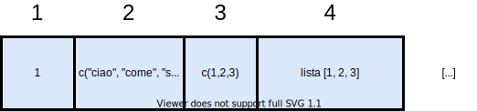

```{r setup, include=FALSE}
options(htmltools.dir.version = FALSE)
```

```{r slide-setup, include=FALSE}
knitr::opts_chunk$set(echo = TRUE, 
                      fig.retina = 2, 
                      dpi = 300,
                      fig.align = "center")
```

class: title-slide, center, middle

#.title[Strutture dati in R]

#.subtitle[Giornata 2]

```{r, out.width="10%", echo = FALSE}
knitr::include_graphics(path = "img/arca_logo.svg")
```

###.location[Corsi ARCA - @DPSS]

###.author[Filippo Gambarota]

---
class: section, center, middle

# Recap sulle tipologie di dato

---

# Strutture dati

- Finora abbiamo visto oggetti semplici, tuttavia poter creare, manipolare e gestire **strutture dati complesse** è fondamentale in R.

- Le strutture dati sono modalità di **immagazzinare diverse informazioni** con una certa logica e utile per eseguire altre operazioni complesse.

---
# Strutture dati

Tutti voi avete presente un foglio di calcolo:

```{r, echo = FALSE, out.width="80%"}
knitr::include_graphics("img/foglio_excel.png")
```

---
# Strutture dati in R

In R sono presenti diverse strutture dati di diversa complessità:

- Vettori
- Fattori
- Matrici
- Dataframe
- Liste

---
# Attributi

Gli oggetti in R possiedono degli **attributi** che forniscono informazioni aggiuntive:

- *nomi*: possiamo fornire delle etichette ad ogni elemento
- *dimensioni*: fornisce il numero di elementi per ogni dimensione nell'oggetto

---
# Come affrontarle?

- Creazione
- Attributi
- Indicizzazione
- Manipolazione
- Operazioni (se rilevante)

---
class: section, center, middle

# Vettori - The big picture

---

```{r, echo = FALSE}

```

---

# Vettori - Disclaimer

I vettori (**atomic**) sono una struttura dati *unidimensionale* e sono la più semplice presente in R. Ci sono alcune cose importanti:

- Possono contenere informazioni di una sola *tipologia* (come numeri, stringhe, etc.)
- Essendo *unidimensionali* ogni elemento corrisponde ad una posizione
- Sono l'elemento fondante di strutture dati più complesse come matrici e dataframe
- Quelli che in R si chiamano `vectors` sono gli `atomic vectors` perchè anche le `liste` (che vedremo) sono dei `vectors` ma che possono contenere elementi eterogenei

---
# Vettori

```{r, echo = FALSE}
knitr::include_graphics("img/vector.png")
```

---
# Vettori - creazione

Per creare un vettore si usa la funzione `c()` che sta per **concatenazione** e permette appunto di unire una serie di elementi:

.pull-left[

```{r}
my_int <- c(1:10) # vettore di interi
my_int

my_dbl <- c(1.2, 3.4, 5.5) # vettore di double
my_dbl

my_lgl <- c(TRUE, FALSE, TRUE)
my_lgl

my_chr <- c("ciao", "come", "stai")
my_chr

```
]

.pull-right[

```{r}
class(my_int)
class(my_dbl)
class(my_lgl)
class(my_chr)
```

]

---
# `is.*` e `as.*` family

Possiamo *testare* o *convertire* (quando possibile) la tipologia di un vettore usando le funzioni `is.*` e `as.*`:

```{r}
is.integer(my_int)

my_dbl
as.integer(my_dbl)

as.integer(my_lgl) # cosa succede di strano?

as.numeric(my_chr) # cosa succedere di strano?
```

---
# I valori `NA`

C'è una sola tipologia di dato che può coesistere in un vettore (atomic) e sono gli `NA` (**N**ot **A**pplicable) e rappresentano dei valori mancanti per varie ragioni:

```{r}
my_int <- c(1,2,5,"ciao") # convertito a stringa
my_int

my_int <- c(1,2,3, NA) # NA viene convertito in numeric
my_int
```

Quello che succede in realtà è che ci sono altrettante tipologie di `NA` come `NA_logical_`, `NA_integer_` etc. e viene usato quello compatibile con il resto del vettore.

---
# Vettori - Attributi

Gli attributi possibili per un vettore (atomic) sono:
- `names()`: ogni elemento può essere associato ad un nome/etichetta
- Dimensione (`dim()`), in realtà con il vettore unidimensionale usiamo `length()`

```{r}
x <- 1:10
names(x) # di default non ci sono nomi
names(x) <- letters[1:10] # assegnamo una lettera ad ogni posizione
setNames(x, letters[1:10]) # modo alternativo
dim(x) # NULL
length(x) # ci fornisce la lunghezza
```

---
# Vettori - Indicizzazione

L'indicizzazione dei vettori è la più semplice essendo *unidimensionali*. Essendo l'unica proprietà la **lunghezza** (`length(vettore)`) possiamo selezionare, eliminare, estrarre elementi semplicemente usando l'**indice di posizione** tramite le parentesi quadre `vettore[pos]`:

```{r}
my_vec <- round(runif(20, 1, 100))
my_vec

my_vec[1] # estraggo il primo elemento
my_vec[1:10] # estraggo i primi 10 elementi
my_vec[c(1,5,10,16)] # estraggo n elementi a varie posizioni
my_vec[length(my_vec)] # estraggo l'ultimo elemento
```

---
# Vettori - Indicizzazione

Possiamo anche indicizzare (meno comune) con i nomi (se li abbiamo impostati come nella slide *attributi*):

```{r}
x <- 1:10
names(x) <- letters[1:10]
x["a"]
x[c("a", "b", "c")]
```

In generale comunque non è molto comune usare i nomi per i vettori ma in alcuni casi può essere utile.

---
# Vettori - Indicizzazione Logica

Indicizzare con la posizione è l'aspetto più semplice e intuitivo. E' possibile anche selezionare tramite valori `TRUE` e `FALSE`. L'idea è che se abbiamo un vettore di lunghezza *n* e un'altro vettore logico di lunghezza *n*, tutti gli elementi `TRUE` saranno selezionati:

```{r}
my_vec <- 1:10
my_selection <- sample(rep(c(TRUE, FALSE), each = 5)) # random TRUE/FALSE
my_selection
my_vec[my_selection]
```

---
# Vettori - Indicizzazione Logica

Chiaramente non è pratico costruire a mano i vettori logici. Infatti possiamo usare delle *espressioni relazionali* per selezionare elementi:

```{r}
my_vec <- 1:10
my_selection <- my_vec < 6
my_vec[my_selection]
my_vec[my_vec < 6] # in modo più compatto
```

---
# Vettori - Indicizzazione Logica

Chiaramente possiamo usare **espressioni di qualsiasi complessità** perchè essenzialmente abbaimo bisogno di un vettore `TRUE/FALSE`:

```{r}
my_vec <- 1:10
my_selection <- my_vec < 2 | my_vec > 8
my_vec[my_selection]
my_vec[my_vec < 2 | my_vec > 8] # in modo più compatto
```

---
# Vettori - Indicizzazione Intera `which()`

La funzione `which()` è molto utile perchè restituisce la **posizione** associata ad una selezione logica:

```{r}

my_vec <- rnorm(10)
which(my_vec < 0.5)

# Questo

my_vec[which(my_vec < 0.5)]

# e questo sono equivalenti

my_vec[my_vec < 0.5]

```

---
# Vettori - Indicizzazione Negativa `-`

Allo stesso modo di selezionare elementi con `[]`, indici di posizione e indici logici è possibile "rimuovere" degli elementi da un vettore, o in altri termini **non** selezionare alcuni elementi tramite il segno meno `-`:

```{r}
my_vec <- 1:10

my_vec[-c(1,2)] # rimuovo i primi 2
my_vec[!my_vec > 5] # rimuovo i maggiori di 5, chiaramente uguale a selezionare i minori
```

---
class: section, center, middle

# Extra - Valori NA in tutte le salse

---

class: section, center, middle

# Fattori

---
# Fattori

I fattori sono una tipologia di dato peculiare e per quanto simile a semplici `characters` in realtà sono un tipo di vettore `integer` con delle proprietà aggiuntive.

```{r, echo = FALSE}
knitr::include_graphics("img/factors.png")
```

---
# Fattori - Creazione

I fattori si creano in modi diversi sia convertendo un vettore `character` con `as.factor()` che creando esplicitamente un fattore con `factor()`:

```{r}
my_chr <- rep(c("a", "b", "c"), c(3, 4, 2))
as.factor(my_chr)
my_fac <- factor(my_chr)
my_fac
```

---
# Fattori - Attributi

I fattori fanno ampiamente uso degli attributi in particolare:

```{r}
typeof(my_fac)
attributes(my_fac)

# Notate la differenza tra
as.integer(my_fac)
# e
as.integer(my_chr)
```

I fattori quindi permettono di avere dei livelli `levels()` come metadati, a prescindere da quali sono effettivamente presenti nel vettore

---
# Fattori - Indicizzazione

L'indicizzazione è esattamente la stessa che per i vettori atomic (essendo i fattori degli `integers`) tuttavia anche la selezione preserverà i metadati:

```{r}
my_fac[1]
my_fac[1:5]
```

---
# Fattori Ordinali (extra)

Un sottotipo dei fattori sono gli `ordered factors` che corrispondo alle variabili ordinali, ovvero dove i livelli sono ordinati in modo crescente:

```{r}
my_ord_fac <- as.ordered(my_fac)
my_ord_fac
attributes(my_ord_fac)
```

---
class: section, center, middle

# Liste

---
# Liste

La lista è una generalizzazione dell' **atomic vector** dove:

- i **dati** possono essere di **diversa tipologia**
- ogni elemento può essere **a sua volta una lista**
- sono una struttura dati *unidimensionale* ma possono svilupparsi in **profondità** (ci arriviamo)

```{r, echo=FALSE}

```

---
# Liste

.pull-left[

```{r, echo = FALSE, out.width="70%"}
knitr::include_graphics("img/list_example.png")
```

]

.pull-right[

```{r, echo = FALSE, out.width="80%"}
knitr::include_graphics("img/list_depth.png")
```

]

---
# Liste - Creazione

Per creare una lista si può usare il comando list, specificando gli elementi ed eventualmente un nome associato ad ogni elemento:

```{r}
my_list <- list(
    1:10,
    rep(c("a", "b", "c"), each = 3),
    my_fac
)

my_list

```

---

# Liste - Attributi

Come per i vettori anche le liste hanno una lunghezza (`lenght()`) ed eventualmente dei nomi (`names()`). Il comando `str()` (struttura) è molto utile per le liste perchè fornisce una visione sulla struttura:

```{r}
names(my_list)
length(my_list)
str(my_list)

names(my_list) <- c("elemento1", "elemento2", "elemento3")
```

---
# Liste - Indicizzazione

L'indicizzazione è più "complessa" ma molto simile ai vettori. Possiamo indicizzare con parentesi quadre `lista[n]` o con le doppie parentesi quadre `lista[[n]]`. Se a lista è una `named list` quindi con associati i nomi, possiamo usare `$` con il nome associato `lista$nome_elemento`:

```{r}
my_list[1] # accedo al primo elemento COME LISTA
my_list[[1]] # accedo al primo elemento
my_list$elemento1 # accedo con il nome
my_list["elemento1"]
my_list[["elemento1"]]
```

---
# Liste - Indicizzazione

La differenza tra le parentesi quadre riguarda il fatto se vogliamo fare un subset della lista ottenendo un'altra lista oppure se vogliamo accedere direttamente all'elemento interno.

Se vogliamo selezionare più elementi (quindi fare un vero e proprio subset della lista) dobbiamo sempre usare le paarentesi quadre singole:

```{r}
my_list[1:2]
my_list[[1:2]]
```

---
# Liste - Indicizzazione Nested

Come abbiamo visto le liste possono contenere altre liste, ottendo una struttura *unidimensionale* ma che si può sviluppare in profondità. Per selezionare elementi *nested* si possono concatenare più parentesi:

```{r}
my_list <- list(1:10, letters[1:10], rnorm(10))
my_list <- list(my_list, rnorm(10), rnorm(10))
str(my_list)
```

---
# Liste - Indicizzazione Nested

```{r}
my_list[[1]][[1]] # primo elemento della prima lista
my_list[[1]][[1]][[1]] # primo elemento del primo elemento della prima lista
```

C'è anche un modo meno intuitivo ma equivalente per indicizzare in modo ricorsivo:

```{r}
my_list[[c(1,2)]] # equivalente a my_list[[1]][[2]]
```

---
# Modificare elementi

Per modificare elementi posso usare l'approccio selezione e riassegnazione:

```{r, eval=FALSE}
my_list[1] <- list(oggetto) # se uso le parentesi singole [] devo assegnare una lista
my_list[[1]] <- oggetto # se uso le doppie, riassegno direttamente l'oggetto
```

In generale valgono gli stessi principi dei vettori (atomics) quindi selezione negativa `lista[-index]` e selezione multipla `lista[1:n]`
---
class: section, center, middle

# Matrici

---
# Matrici - Creazione

Le matrici sono una struttura dati *bidimensionale* caratterizzate da `righe` e `colonne` ovvero le dimensioni `dim()` dove il numero di righe rappresenta la dimensione 1 e il numero di colonne la dimensione 2. La matrice si crea con il comando `matrix(data, nrow, ncol, byrow =, dimnames=)`:

```{r}
# usare indici progressivi come dato è utile per capire l'argomento byrow

my_mat <- matrix(data = 1:9, ncol = 3, nrow = 3, byrow = FALSE)
my_mat
t(my_mat) # inverte righe e colonne, equivalente a mettere byrow = TRUE
dim(my_mat)
attributes(my_mat)
```

---
# Matrici - Creazione

Il numero di righe e colonne non deve essere lo stesso necessariamente (matrice quadrata) ma il numero di righe deve essere compatibile con il vettore `data`:

```{r}
matrix(data = 1:100, ncol = 3, nrow = 3)
matrix(data = 1:9, ncol = 5, nrow = 5)
```

Cosa è successo alle matrici? E' un errore? Cosa fa R di default?

---
# Matrici - Creazione

Tendenzialmente le matrici sono usate per calcolo e statistica e non è comune usare dei nomi per le colonne/righe (vedi `dataframe`) ma usando il comando `dimnames =` o `dimnames(matrix) <- list(rownames, colnames)`:

```{r}
# Ci serve una lista con nomi di righe e colonne
dim_names <- list(
    c("row1", "row2", "row3"),
    c("col1", "col2", "col3")
)

my_mat <- matrix(data = 1:9, ncol = 3, nrow = 3, dimnames = dim_names)
dimnames(my_mat) <- dim_names
my_mat
```

---
# Matrici - Operazioni

Senza andare nei meandri dell'algebra, le matrici (come i vettori) possono essere usati per operazioni matematiche:

```{r}
my_mat + my_mat
my_mat * my_mat
my_mat %*% my_mat
my_mat + 1
```

---

# Matrici - Indicizzazione

Anche l'indicizzazione è un'estensione di quella per i vettori adattata alle due dimensioni. Per identificare uno o più elementi nella matrice abbiamo bisogno di **indici/e di riga e/o colonna** separati da **virgola**, sempre con le parentesi quadre: `matrice[riga, colonna]`:

```{r}
my_mat[1,1] # primo elemento della prima riga e colonna
my_mat[3,3]
my_mat[1, ] # tutta la prima riga
my_mat[ ,1] # tutta la prima colonna
```

---
# Matrici - Indicizzazione Logica

Come per i vettori anche la matrice può essere usata per operazioni *relazionali* ed essere indicizzata in modo logico:

```{r}
my_mat > 4 # matrice logica
my_mat[my_mat > 4]
```

Come vedete restituisce un vettore che rispetta la selezione, ma non una matrice.

---
# Matrici non numeriche

Questa (abbastanza inutile) variante delle matrici è possibile perchè come per i vettori possiamo avere matrici logiche, di stringhe etc. ma dati diversi non possono coesistere:

```{r}
my_mat > 3
is.logical(my_mat > 3)

matrix("R", nrow = 3, ncol = 3) # notate che se l'argomento data è un solo elemento questo viene riciclato
```

L'indicizzazione è la medesima mentre le operazioni (matematiche) sono possibili solo per matrici numeriche.

---

Come per i vettori ci sono alcune cose rilevanti:

- Possono contenere una sola tipologia di dati
- Essendo bidimensionali, abbiamo bisogno di due indici di posizione (righe e colonne) per identificare un elemento
- Possono essere viste come un insieme di singoli vettori

---
# Matrici - Attributi

In parte lo abbiamo già visto ma le matrici hanno come attributi la dimensione `dim()` ovvero il numero di righe `nrow()` e il numero di colonne `ncol()`. Inoltre le dimensioni possono avere anche un nome `dimnames()`:

```{r}
attributes(my_mat)
dim(my_mat)
ncol(my_mat)
nrow(my_mat)
dimnames(my_mat)
```

---
# Matrici

Se per i vettori possiamo unire elementi con `c(1,2,3)` o unire vettori `c(vec1, vec2)` con le matrici possiamo usare i comandi `cbind()`
e `rowbind()`:

```{r, echo=FALSE, out.width="80%"}

```
---
# Extra: Array

Gli array sono degli oggetti *n-dimensionali*. Se la matrice è un quadrato un array è un cubo. Valgono le stesse proprietà della matrice chiaramente scalate alle *n dimensioni*:

```{r}
my_array <- array(1:27, dim = c(3,3,3)) # esempio tridimensionale
my_array
```

---
# Extra: Array

L'indicizzazione avviene allo stesso modo delle matrici aggiungendo una dimensione: `my_array[riga, colonna, dimensione]`

```{r}
my_array[1,1,1] # prima riga, prima colonna, prima "fetta"
```

Anche gli attributi sono gli stessi ma chiaramente scalati su *n* dimensioni. Le dimensioni sono potenzialmente "infinite" ma aumenta anche la complessità e la
praticità della struttura dati. Ad esempio un array a 4 dimensioni è un insieme di array a 3 dimensioni (e già diventa complesso).

---
class: section, center, middle

# Dataframe

---
# Dataframe

Il dataframe è la struttura più "complessa", utile e potente di R. Da un punto di vista intuitivo è un *foglio excel* mentre da un punto di vista
di R è una tipologia di lista con alcune caratteristiche/restrizioni<sup>1</sup>

- ogni elemento della lista è un **vettore con un nome associato** (aka una colonna)
- ogni **lista/colonna** deve avere lo **stesso numero di elementi**
- di conseguenza ogni **riga** ha lo **stesso numero di elementi** (struttura *rettangolare*)

.footnote[
[1] [Advanced R - Hadley Wickam](https://adv-r.hadley.nz/vectors-chap.html)
]

---
# Dataframe - Creazione

La creazione di un `dataframe` è molto simile alla lista tramite la funzione `data.frame(colonna_1, colonna_2, colonna_n)` 
dove ogni colonna è un vettore di uguale lunghezza.

```{r}
my_df <-data.frame(
    colonna1 = 1:10,
    colonna2 = letters[1:10],
    colonna3 = rnorm(10),
    colonna4 = runif(10)
)
my_df
```
---
# Dataframe - Attributi

Vediamo che il `dataframe` ha infatti sia gli attributi della `lista` ovvero i `names` ma anche gli attributi della `matrice`
ovvero le dimensioni (righe e colonne):

```{r}
typeof(my_df) # è una lista
attributes(my_df) # ma ha anche una classe dedicata
dim(my_df)
nrow(my_df)
ncol(my_df)
```
---
# Dataframe - Indicizzazione

Anche per l'indicizzazione il dataframe acquisisce le proprietà della `matrice` e della `lista` con nomi associati. In particolare
posso usare le parentesi quadre `[]` oppure il simbolo del dollaro `$`:

.pull-left[

```{r}
# Indicizzazione come matrice
my_df[1,1]
my_df[1, ]
my_df[, 1]
```
]

.pull-right[

```{r}
# Indicizzazione come matrice
my_df$colonna1
```
]

---
# Dataframe - Indicizzazione

Per dimostrare che il dataframe è essenzialmente una matrice, possiamo usare la doppia parentesi quadra per estrarre
una colonna e non `[riga,colonna]`:

```{r}
my_df[[1]] # estraggo la prima colonna
my_df[["colonna1"]] # estraggo la prima colonna usando il nome
```
---
# Dataframe - Indicizzazione

In generale, l'indicizzazione del dataframe è quella più complessa ed efficiente, sopratutto combinata con
**operazioni relazionali**:

```{r}
my_df[my_df$colonna1 > 4, ]
my_df[my_df$colonna1 > 4 & my_df$colonna4 > 0.1, ]
my_df[my_df$colonna1 > 4, "colonna4"]
my_df[my_df$colonna1 > 4, 1]
```

# Dataframe - Indicizzazione

L'idea generale è semplice ovvero quando seleziono faccio operazioni sulle **righe** (seleziono alcune righe) ed eventualmente sulle
**colonne** (seleziono alcune colonne). Attenzione però a cosa viene restituito!

```{r}
typeof(my_df[1,1])
typeof(my_df[1, ])
typeof(my_df[, 1])
```
Viene restituito non sempre un dataframe, per evitare questo (se è necessario) possiamo usare `drop = FALSE`
per ottenere sempre un dataframe:

```{r}
typeof(my_df[, 1, drop = FALSE])
typeof(my_df[1,1, drop = FALSE])
```

---
# Dataframe - Indicizzazione `subset()`

Ci sono anche dei modi alternativi e più compatti di indicizzare. Ad esempio usando la funzione `subset()`:

```{r}
subset(iris, subset = Species == "setosa" & Sepal.Length > 4)
```

E' equivalente a:

```{r}
iris[iris$Species == "setosa" & iris$Sepal.Length > 4, ]
```

---
# Dataframe - Indicizzazione `subset()`

Possiamo anche selezione delle colonne invece che righe:

```{r}
# usando i nomi delle colonne
subset(iris, select = c(Sepal.Length, Species)) # equivale a iris[, c("Sepal.Length", "Species")]

# oppure usando indici
subset(iris, select = c(1, 5))
```

---
# Dataframe - Indicizzazione `subset()`

Possiamo anche combinare le due cose facendo una selezione di righe e colonne:

```{r}
subset(iris, Species == "setosa" & Sepal.Length > 4, c(Sepal.Length, Species))
```

E' equivalente a:

```{r}
iris[iris$Species == "setosa" & iris$Sepal.Length > 4, c("Sepal.Length", "Species")]
```
---
# Dataframe - Indicizzazione - *data mask*

Cosa fa `subset` di speciale? essenzialmente prende delle espressioni `Species == "setosa"` che vengono eseguite all'interno dell'ambiente dataframe specificato come primo argomento. Un più generico esempio del data masking è la funzione `with`:

```{r}
Sepal.Length <- "ciao"
with(iris, Sepal.Length + Sepal.Width) # se usasse la variabile definita prima darebbe errore
```

L'espressione `Sepal.Length + Sepal.Width` viene eseguita all'interno (`with`) del dataframe `iris` in modo da eseguire anche operazioni complesse tra le colonne di `iris` senza dover ogni volta specificare `iris$variabile`.

---
class: section, center, middle

# Extra - Importazione dati