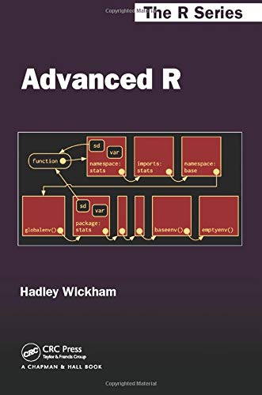
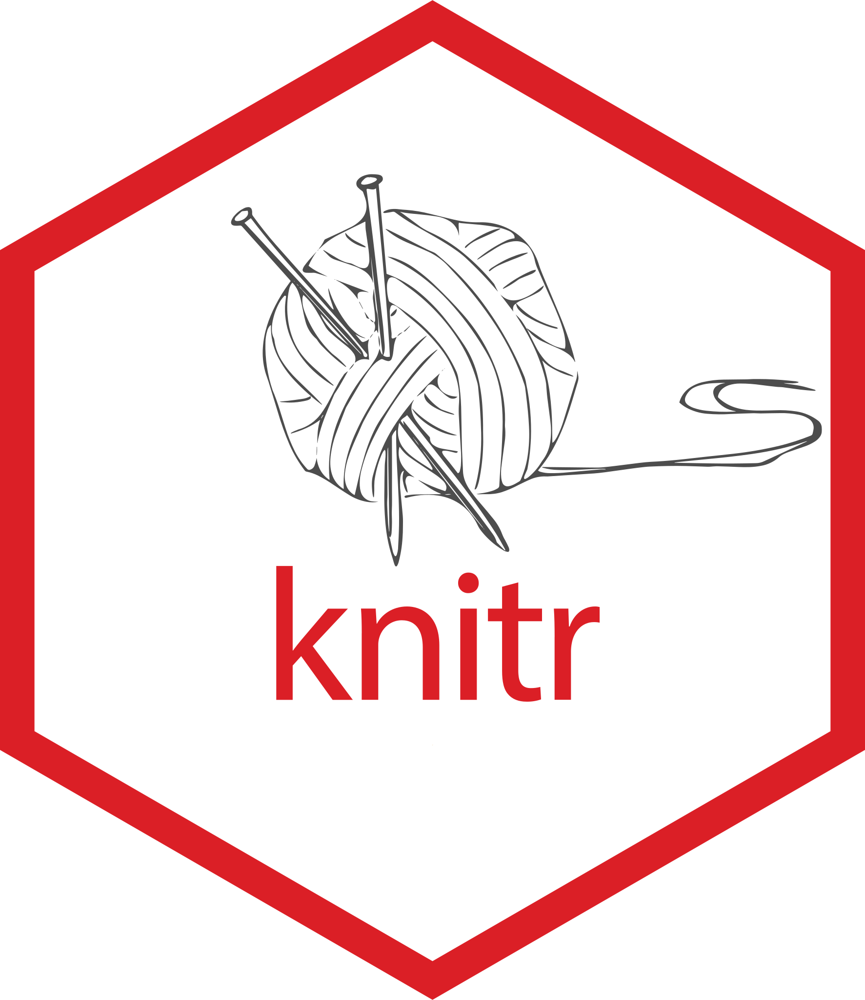
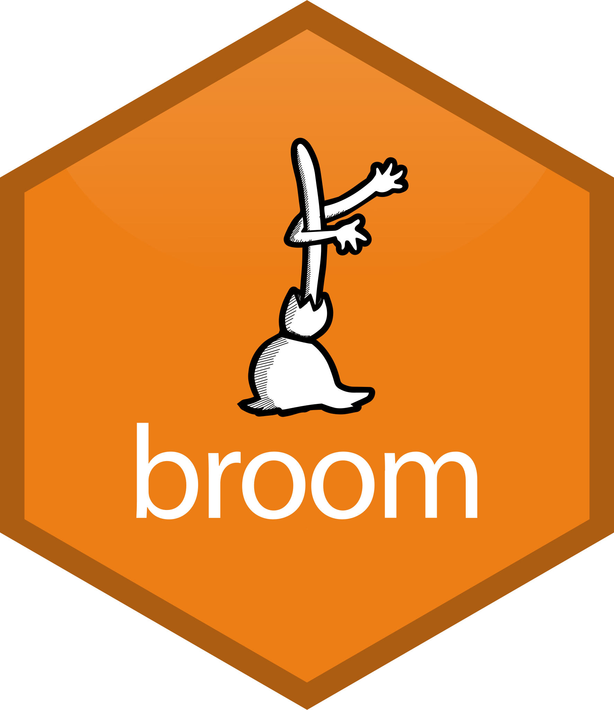

```{r setup, include=FALSE}
options(htmltools.dir.version = FALSE)
```

```{r slide-setup, include=FALSE}
knitr::opts_chunk$set(echo = TRUE, 
                      fig.retina = 2, 
                      dpi = 300,
                      warning = FALSE,
                      message = FALSE,
                      fig.align = "center")
```

```{r packages, echo=FALSE}
devtools::load_all()
library(ggplot2)
library(dplyr)
library(broom)
library(flextable)
library(kableExtra)
library(purrr)
```

class: title-slide, center, middle

#.title[`r rmarkdown::metadata$title`]

#.subtitle[`r rmarkdown::metadata$subtitle`]

```{r, out.width="10%", echo = FALSE}
knitr::include_graphics(path = "img/arca_logo.svg")
```

###.location[`r rmarkdown::metadata$institute`]

###.author[`r rmarkdown::metadata$author`]

---
class: section, center, middle

# What to do now? `r emo::ji("thinking")`

---
# Cosa abbiamo visto?

- I tipi di oggetti in R
- Strutture dati: come creare, accedere, manipolare
- Programmazione condizionale e iterativa (`for`, `if else`, `*apply`)
- Importare/esportare file

Un sacco di cose! `r emo::ji("smile")`. Ma è tutto qui? Nope `r emo::ji("zany_face")`

---
# Manipolazione dataframe avanzata con `dplyr`

Possiamo utilizzare tutte le conoscenze su come manipolare i dataframe e sulle tipologie di dato con un pacchetto che ormai è diventato lo standard. `dplyr` permette di fare qualsiasi cosa con un dataframe:

.pull-left[

```{r, out.width = "50%", fig.cap = cap_link("https://dplyr.tidyverse.org/"), echo = FALSE}
knitr::include_graphics("img/dplyr.svg")
```

]

.pull-right[

- ordinare righe e colonne
- modificare colonne con operazioni complesse
- selezionare righe e colonne con operazioni complesse

]

---
# Trasformare dataframe con `tidyr`

Spesso dobbiamo trasformare i dataframe in diversi formati ad esempio da formato `long` a formato `wide` e viceversa. Questa operazione è molto complessa ma `tiyr` la implementa in modo estremamente semplice. Creiamo un dataframe in formato `long`:

.pull-left[

```{r, echo = FALSE, fig.cap = cap_link("https://tidyr.tidyverse.org/"), out.width = "50%"}

```


]

.pull-right[

```{r}
datlong <- expand.grid(
    id = 1:10,
    cond = c("a", "b", "c")
)

datlong$y <- rnorm(nrow(datlong))

head(datlong)
```

]

---
# Trasformare dataframe con `tidyr`

Adesso possiamo trasformare il dataframe in formato `wide` con una semplice linea di codice con la funzione `pivot_wider()`

```{r}
datwide <- tidyr::pivot_wider(datlong, names_from = cond, values_from = y)

head(datlong)
```

---
# Trasformare dataframe con `tidyr`

Chiaramente possiamo anche ritornare al formato originale usando la funzione `pivot_longer()`:

```{r}
datlong <- tidyr::pivot_longer(datwide, c(a, b, c), names_to = "cond", values_to = "y")

head(datlong)
```

---
# Combinare funzioni con `%>%` o `|>`

Quando vi capitera di cercare codice o soluzioni online che riguardano R, il 90% del codice avrà questi strani simboli `%>%` o `|>`. Abbiamo già imparato che questi sono operatori (e quindi funzioni). Questi operatori permettono di concatenare una serie di funzioni in modo molto intuitivo e leggibile. In altri termini `f(x)` è equivalente a `x %>% f()`. Queste si chiamano **pipes**:

```{r}
x <- rnorm(100)
mean(x)
x %>% mean()
x |> mean()
```

---
# Combinare funzioni con `%>%` o `|>`

Con funzioni semplici non hanno molto senso ma con *pipeline* più complesse il codice diventa molto leggibile. Se volessimo concatenare una serie di funzioni di `dplyr` (ma funziona con tutte le altre funzioni):

```{r, eval = FALSE}
iris <- group_by(iris, Species)
iris <- summarise(iris, y = mean(Sepal.Width))
iris <- arrange(iris, y)
iris <- mutate(iris, z = y + 1)
iris <- filter(iris, y > 0)
```

Usando la **pipe**:

```{r, eval = FALSE}
iris %>%
  group_by(Species) %>%
  summarise(y = mean(Sepal.Width)) %>%
  arrange(y) %>%
  mutate(z = y + 1) %>%
  filter(y > 0)
```

---
# Grafici super con `ggplot2`

Un pacchetto estremamente potente che si basa su molte delle cose che abbiamo visto e sulla sintassi simil `dplyr` e **pipe-based** è `ggplot2`:

.pull-left[

```{r out.width="50%", echo = FALSE, fig.cap = cap_link("https://ggplot2.tidyverse.org/index.html")}
knitr::include_graphics("img/ggplot2.svg")
```

]

.pull-right[

```{r, out.width = "70%"}
ggplot(iris, aes(Sepal.Length, Petal.Length, color = Species)) + 
    geom_point(size = 3) +
    theme_minimal(base_size = 20) +
    theme(legend.position = "bottom")
```

]

---
# Programmazione funzionale/iterativa

Il pacchetto `purrr` fornisce un insieme di funzioni che vanno a migliorare la `*apply` family con funzioni extra ed una maggiore robustezza. Se avete capito l'`*apply` family, `purrr` può essere un modo più efficiente di utilizzarle

.pull-left[

```{r, out.width = "50%", fig.cap = cap_link("https://tidyr.tidyverse.org/"), echo = FALSE}
knitr::include_graphics("img/purrr.svg")
```

]

.pull-right[

```{r}
sapply(mtcars, mean)
map_dbl(mtcars, mean) # controlla che l'output sia sempre numerico
```

]

---
# The amazing `tidyverse`

Tutto questo (e molto altro) fa parte di un insieme di pacchetti per lavorare con i dati raccolti in un meta-pacchetto chiamato `tidyverse`. Questo permette di lavorare in molto molto più consistente ed intuitivo per manipolare, analizzare e rappresentare dati di tutti i tipi.

```{r, out.width = "20%", fig.cap = cap_link("https://www.tidyverse.org/"), echo = FALSE}
knitr::include_graphics("img/tidyverse.svg")
```

---
# Come approfondire?

Adesso abbiamo le competenze di base per capire qualsiasi nuova funzione/pacchetto in R. Per approfondire il `tidyverse` vi consiglio:

```{r, fig.cap = cap_link("https://r4ds.had.co.nz/"), echo = FALSE, out.width = "20%"}
knitr::include_graphics("img/r4ds.png")
```

---
# Come approfondire?

Per capire a fondo tutte le cose che abbiamo visto ed espandere al massimo la conoscenza di R come linguaggio di programmazione vi consiglio il libro **advanced R**

```{r, fig.cap = cap_link("https://adv-r.hadley.nz/"), echo = FALSE, out.width = "20%"}

```

---
# Come approfondire?

Anche `ggplot2` ha un suo libro associato che oltre a fornire un framework teorico sulle rappresentazioni grafiche in generale chiamato *grammar of graphics* spiega nel dettaglio il funzionamento del pacchetto

```{r, fig.cap = cap_link("https://ggplot2-book.org/"), echo = FALSE, out.width = "20%"}
knitr::include_graphics("img/ggplotbook.jpg")
```

---
class: section, center, middle

# Altri argomenti utili...

---
# Lavorare in modo avanzato con le stringhe

Le stringhe sono uno strumento molto potente da conoscere per organizzare al meglio le vostre analisi. E' anche un argomento vasto e complesso ma questi riferimenti sono un buon punto di partenza:

- [Capitolo 16](https://psicostat.github.io/Introduction2R/stringhe.html) del libro `introduction2R`
- [Capitolo 14](https://r4ds.had.co.nz/strings.html) del libro `R4DS`
- [Regex](https://cran.r-project.org/web/packages/stringr/vignettes/regular-expressions.html) ovvero Regular Expressions

---
# Literate programming - R Markdown

R Markdown è uno strumento estramente potente che permette di combinare testo e codice per creare documenti, slides (queste ad esempio), siti web, tesi, articoli scientifici etc.

.pull-left[

```{r, out.width="50%", echo = FALSE, fig.cap = cap_link("https://cran.r-project.org/web/packages/knitr/index.html", "knitr website")}

```

]

.pull-right[

```{r, out.width="50%", echo = FALSE, fig.cap = cap_link("https://rmarkdown.rstudio.com/")}

```

]

---
# Creare tabelle

Spesso dobbiamo creare delle tabelle da inserire nei documenti o in file R Markdown. Ci sono diversi pacchetti per questo ad esempio `flextable()`, `kableExtra()` o anche `sjPlot()`.

Creiamo una tabella di statistiche descrittive:

```{r}
df_sum <- iris |> 
    group_by(Species) |> 
    summarise(mean = mean(Sepal.Length),
              sd = sd(Sepal.Length),
              se = sd / sqrt(n()),
              min = min(Sepal.Length),
              max = max(Sepal.Length))
df_sum
```


---
# Creare tabelle con `flextable`

`flextable` permette di creare tabelle molto complesse e di salvarle in vari formati tra cui `docx` per poterle usare poi in formato `word`. Il punto di partenza è sempre un dataframe. Il sito di [`flextable`](https://ardata-fr.github.io/flextable-book/) contiene tantissa documentazione.

```{r}
df_sum |>
    flextable() |> 
    theme_vanilla() |> 
    autofit() |> 
    colformat_double(digits = 2)
```

---
# Creare tabelle con `kableExtra`

`kableExtra` è un altro ottimo pacchetto molto utilizzato per documenti R Markdown per creare tabelle in **html** e **pdf**. La documentazione per tabelle in [**html**](https://cran.r-project.org/web/packages/kableExtra/vignettes/awesome_table_in_html.html) e [**pdf**](https://cran.r-project.org/web/packages/kableExtra/vignettes/awesome_table_in_pdf.pdf) è ottima. Si parte sempre da un dataframe:

```{r}
df_sum |>
    kable() |> 
    kable_styling(bootstrap_options = c("striped"), 
                  full_width = FALSE)
```

---
# Creare tabelle da modelli statistici con `sjPlot`

[`sjPlot`](https://cran.r-project.org/web/packages/sjPlot/index.html) è un pacchetto tuttofare che tra le altre cose crea grafici e tabelle partendo non da dataframe ma da oggetti di modelli inserendo una serie di informazioni utili in automatico.

```{r}
fit <- lm(Sepal.Length ~ Petal.Length, 
          data = iris)

sjPlot::tab_model(fit)
```

---
# Creare tabelle da modelli statistici con `broom`

[`broom`](https://cran.r-project.org/web/packages/broom/vignettes/broom.html) ha un approccio diverso (quello che preferisco) creando dei dataframe da modelli statistici e poi lasciando all'utente la creazione della tabella con `flextable` o `kableExtra`:

.pull-left[

```{r, out.width = "50%", fig.cap = cap_link("https://broom.tidymodels.org"), echo = FALSE}

```

]

.pull-right[

```{r}
tidfit <- broom::tidy(fit)
tidfit
```

]

---
# Materiale

Nel sito del corso [arca-dpss.github.io/course-R](https://arca-dpss.github.io/course-R/) è presente una sezione con articoli, libri e materiale di approfondimento di tutto quello che abbiamo visto e di questi argomenti extra. Nel tempo questo materiale potrebbe crescere ma sarà sempre disponibile nel link indicato `r emo::ji("smile")`